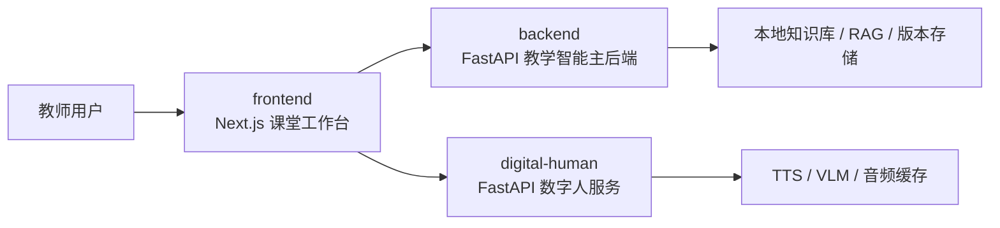
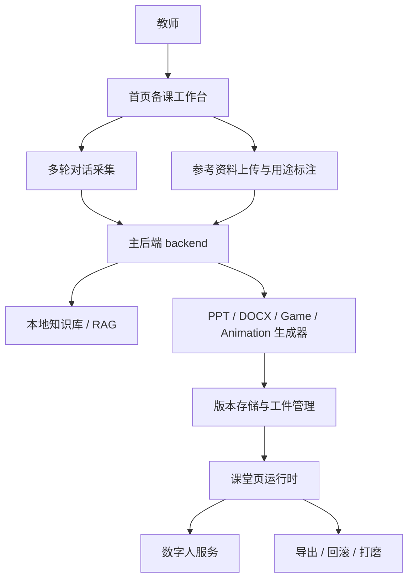
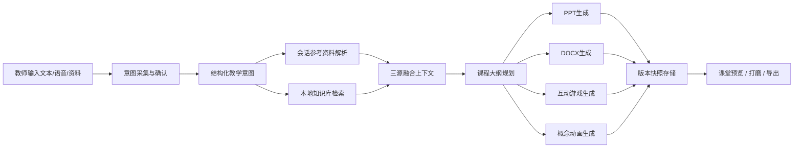

# 智绘生物·多模态AI互动式教学智能体  
## 项目详细方案

> 说明：本文以三类材料为共同依据撰写。第一，项目根目录下的 [README.md](/D:/ITO/ITO/ITO/README.md)；第二，服务外包大赛 A04“多模态AI互动式教学智能体”赛题要求；第三，项目当前真实代码实现，重点包括 `frontend`、`backend` 与 `digital-human` 三个目录中的核心模块。文中提及的实现路径均以当前项目源代码为准，避免脱离代码实际能力进行空泛描述。

---

## 第一章 作品概述

### 1.1 项目背景与社会痛点

#### 1.1.1 教师备课链路割裂问题

在真实教学场景中，教师完成一节课的准备工作，往往不是一次“生成PPT”就能结束，而是要经历教学目标梳理、知识点组织、案例搜集、课件制作、教案撰写、课堂互动设计、课后资料导出等多个环节。当前市面上的很多AI工具虽然在某一个环节上有所帮助，但通常是单点式能力，导致教师仍需在聊天工具、PPT工具、文档工具、素材平台、录音转写工具之间频繁切换。  

服务外包大赛 A04 赛题的核心切入点正是这一现实痛点：教师需要的是一个围绕“教学思路”展开的闭环工作流，而不是一堆彼此割裂的按钮。智绘生物项目的整体设计正是围绕这一点展开。  

从代码层面看，这种“工作流化”并非停留在概念描述。前端首页 [page.tsx](/D:/ITO/ITO/ITO/frontend/app/page.tsx) 并不是一个简单文本输入页，而是一个带有模型选择、参考资料上传、参考用途标注、输出预设、输出类型选择、Web 搜索开关、数字人设置入口的“备课工作台”；生成阶段不再依赖单一长请求，而是通过 [generation-preview/page.tsx](/D:/ITO/ITO/ITO/frontend/app/generation-preview/page.tsx) 与 [jobs/courseware route](/D:/ITO/ITO/ITO/frontend/app/api/jobs/courseware/route.ts) 进入异步任务链路；课堂页 [classroom/[id]/page.tsx](/D:/ITO/ITO/ITO/frontend/app/classroom/[id]/page.tsx) 则承担课堂执行、白板互动、讨论、数字人讲解、导出与版本管理等职责。  

因此，本项目所解决的问题不是“帮教师少写几页字”，而是将原本离散的备课流程整合为一条连续、可回滚、可导出、可恢复的教学工作流。

#### 1.1.2 通用大模型生成结果空泛问题

通用大模型在开放领域文本生成上表现强大，但直接用于教学内容生成时，常出现三个问题：第一，表达宏观但不贴教材；第二，结构完整但教学节奏不合理；第三，输出文字看似丰富，实则脱离教师真实意图。对于课堂场景而言，这些问题会直接影响可用性。  

赛题要求明确提出：系统必须能够通过多轮对话理解教师教学目标、知识点、讲授逻辑、重点难点与互动设计思路，并结合参考资料与本地知识库进行融合生成。这意味着系统不能把用户第一句话直接丢给模型，而是要先“理解”，再“生成”。  

智绘生物在实现上采用了“意图优先”的思路。后端 [dialogue_manager.py](/D:/ITO/ITO/ITO/backend/src/rag/dialogue/dialogue_manager.py) 通过 `DialogueState` 显式定义了 `GREETING`、`COLLECTING`、`CONFIRMING`、`READY`、`GENERATING`、`ITERATING` 六个阶段，保证需求采集不是单轮问答，而是结构化状态推进。意图抽取由 [intent_extractor.py](/D:/ITO/ITO/ITO/backend/src/rag/dialogue/intent_extractor.py) 完成，将教学目标、对象、知识点、重点难点、内容组织方式等信息转为结构化对象。随后，主生成链路由 [pipeline_orchestrator.py](/D:/ITO/ITO/ITO/backend/src/rag/services/pipeline_orchestrator.py) 先执行规划，再并行生成 PPT、DOCX、互动游戏和动画等工件。  

换句话说，智绘生物不是让模型“自由发挥”，而是将模型置于“教师意图 + 会话参考资料 + 本地知识库证据”三重边界中工作，从源头减少空话、套话和幻觉。

#### 1.1.3 现有AI教学产品停留在内容生成层的问题

很多AI教学产品即便能生成一份PPT，也往往只停留在“内容输出”层，难以真正进入课堂执行阶段。例如，缺乏互动游戏、缺乏课堂讨论组织能力、缺乏课堂白板联动，更缺乏数字人讲解或导出交付能力。这样的系统更像“文档生成器”，而不是“教学智能体”。  

赛题要求特别强调：系统要能生成 PPT 和 Word 教案，并至少支持动画创意或互动小游戏中的一种；生成后还要支持修改、再生和标准格式导出。这实际上要求作品从“生成内容”升级为“组织课堂执行”。  

智绘生物在代码中已经将这一升级落到了完整实现上。互动内容通过 [game_templates.py](/D:/ITO/ITO/ITO/backend/src/rag/game/game_templates.py) 提供七类 HTML/CSS/JS 可执行模板；课堂页中的讨论与问答通过 [chat-area.tsx](/D:/ITO/ITO/ITO/frontend/components/chat/chat-area.tsx) 与 [roundtable/index.tsx](/D:/ITO/ITO/ITO/frontend/components/roundtable/index.tsx) 组织多角色会话和用户参与；数字人服务由 [avatar_service/main.py](/D:/ITO/ITO/ITO/digital-human/avatar_service/main.py)、[avatar.py](/D:/ITO/ITO/ITO/digital-human/avatar_service/services/avatar.py)、[voice_profile.py](/D:/ITO/ITO/ITO/digital-human/avatar_service/services/voice_profile.py)、[tts.py](/D:/ITO/ITO/ITO/digital-human/avatar_service/services/tts.py) 提供从头像解析、声线匹配、TTS 合成到音频缓存的完整链路。  

因此，本项目的定位不是“帮教师出几份材料”，而是“帮助教师完成一节可讲、可互动、可导出、可迭代优化的完整课”。

### 1.2 相关工作与现状分析

#### 1.2.1 AI辅助教学工具的发展现状

目前 AI 辅助教学工具大致可以分为三类。第一类是对话问答型工具，擅长回答知识问题，但缺乏课堂结构化输出能力；第二类是课件或教案生成型工具，能根据单条指令生成内容，但通常无法处理复杂多轮需求，也缺乏知识库增强；第三类是课堂执行型工具，如白板、录课、互动答题等，但生成能力弱，更多是“播放器”而非“共创者”。  

随着生成式AI、多模态理解、RAG 检索增强和语音技术的发展，将这些能力整合为“教学智能体”已具备现实基础。然而，要真正做到可落地，不能只拼接模型接口，而要构建稳定的工程结构与教学工作流。

#### 1.2.2 现有产品的局限性对比

与现有大多数产品相比，智绘生物的差异不在于“是否调用大模型”，而在于是否围绕教师思路构建闭环系统。传统产品的局限主要表现为：

1. 需求输入浅，只接受单次 prompt，不会主动追问。
2. 资料利用浅，上传附件后不能真正被结构化吸收。
3. 结果单一，只能生成一份内容，缺乏配套教案、互动和课堂执行结构。
4. 迭代能力弱，修改通常意味着重新从头生成。
5. 工程粘合度低，展示层、生成层和执行层缺乏统一数据结构。

智绘生物对应的改进策略在代码里非常清晰：  

1. 通过 [use-homepage-chat.ts](/D:/ITO/ITO/ITO/frontend/lib/hooks/use-homepage-chat.ts) 与 [dialogue_manager.py](/D:/ITO/ITO/ITO/backend/src/rag/dialogue/dialogue_manager.py) 实现多轮需求采集，并在云端失败时使用 [local-requirements-fallback.ts](/D:/ITO/ITO/ITO/frontend/lib/chat/local-requirements-fallback.ts) 做本地规则兜底。  
2. 通过首页的参考资料上传、用途标注和后端统一解析链路，将 PDF、Word、PPT、图片、音视频等资料转入同一知识上下文。  
3. 通过 [pipeline_orchestrator.py](/D:/ITO/ITO/ITO/backend/src/rag/services/pipeline_orchestrator.py) 并行驱动多工件生成，支持 PPT、DOCX、游戏和动画联合输出。  
4. 通过 [header.tsx](/D:/ITO/ITO/ITO/frontend/components/header.tsx) 与 [version_store.py](/D:/ITO/ITO/ITO/backend/src/rag/infrastructure/persistence/version_store.py) 支持课件打磨、版本历史和回滚。  
5. 通过 `frontend + backend + digital-human` 三层服务分离，形成可调试、可替换、可部署的工程架构。  

如果进一步从“企业命题类竞赛作品是否具备交付潜力”的角度观察，上述差异实际上对应了三种更深层的能力差距。第一种差距是**工作流闭环能力**：许多工具能完成一个动作，但无法支撑教师连续完成“表达需求—吸收资料—生成首稿—进入课堂—继续修改—导出交付”这一整条链路；第二种差距是**结构化治理能力**：很多产品依赖模型即时发挥，缺少稳定的数据结构和中间状态，因此一旦需求复杂，结果就容易漂移；第三种差距是**工程承载能力**：同类产品大量存在“功能能演示、系统难交付”的问题，无法在校内网、本地部署或服务化场景中稳定运行。  

智绘生物在这三方面均给出了比较完整的应对。需求侧使用 [use-homepage-chat.ts](/D:/ITO/ITO/ITO/frontend/lib/hooks/use-homepage-chat.ts) 与 [dialogue_manager.py](/D:/ITO/ITO/ITO/backend/src/rag/dialogue/dialogue_manager.py) 保证多轮追问与确认；知识侧使用 [service.py](/D:/ITO/ITO/ITO/backend/src/rag/service.py)、[rag_engine.py](/D:/ITO/ITO/ITO/backend/src/rag/rag_engine.py)、[bootstrap.py](/D:/ITO/ITO/ITO/backend/src/rag/bootstrap.py) 将长期知识库、证据和 trace 组织为稳定能力；生成与交付侧则由 [pipeline_orchestrator.py](/D:/ITO/ITO/ITO/backend/src/rag/services/pipeline_orchestrator.py)、[job_manager.py](/D:/ITO/ITO/ITO/backend/src/rag/services/job_manager.py)、[version_store.py](/D:/ITO/ITO/ITO/backend/src/rag/infrastructure/persistence/version_store.py) 和 [header.tsx](/D:/ITO/ITO/ITO/frontend/components/header.tsx) 构成完整的多工件编排、版本化和导出链路。因此，该项目的优势不是“某个模块特别花哨”，而是“从输入到交付的整条链都具备实现依据”。  

为了更便于评审理解，可以把智绘生物与常见 AI 教学工具在关键维度上做一个直接对照：

| 对比维度 | 常见 AI 教学工具 | 智绘生物的解决方式 | 对真实教学的意义 |
|---|---|---|---|
| 需求理解 | 单轮 Prompt，多为被动响应 | 多轮对话、状态机追问、缺失字段识别 | 教师少输入也能得到更贴题结果 |
| 资料利用 | 附件上传后往往只是陪衬 | 用途标注 + 多模态解析 + 会话级上下文融合 | 参考资料真正进入生成主链路 |
| 知识支撑 | 主要依赖模型内部常识 | 长期知识库 + RAG 证据 + 会话资料三源融合 | 提高学科准确性和可信度 |
| 输出形态 | 多为 PPT 或文本单工件 | PPT、教案、互动游戏、动画、数字人联动 | 从“生成内容”升级为“生成课堂流程” |
| 迭代方式 | 重新生成、难以局部修改 | 课件打磨、目标工件重生成、版本回滚 | 提升教师可控性，减少推倒重来 |
| 工程形态 | 常停留在演示页面 | 三服务解耦、本地部署、版本存储、快照恢复 | 更接近可交付、可维护的系统形态 |

### 1.3 作品简介

#### 1.3.1 多轮对话意图采集模块

首页需求采集模块不是简单输入框，而是一套面向教学任务的对话式引导系统。用户可以通过文本或语音描述自己的教学思路，系统会围绕学科、知识点、教学目标、授课对象、风格、输出类型等信息进行多轮追问，直到需求趋于完整。  

这一能力前端入口位于 [page.tsx](/D:/ITO/ITO/ITO/frontend/app/page.tsx) 和 [use-homepage-chat.ts](/D:/ITO/ITO/ITO/frontend/lib/hooks/use-homepage-chat.ts)。首页还提供四个生物场景快捷提示词按钮，例如“DNA复制与半保留复制”“减数分裂专题”“中心法则”“细胞结构与功能”，帮助用户快速进入生物教学场景。后端对话控制则由 [dialogue_manager.py](/D:/ITO/ITO/ITO/backend/src/rag/dialogue/dialogue_manager.py) 承担，结构化意图抽取由 [intent_extractor.py](/D:/ITO/ITO/ITO/backend/src/rag/dialogue/intent_extractor.py) 完成。  

#### 1.3.2 多模态资料解析与RAG增强模块

系统支持教师上传 PDF、Word、PPT、图片、视频、音频、文本等多种参考资料，并允许为每份资料附加“知识点内容”“排版风格”“案例素材”“习题参考”等用途标记。前端通过 [generation-toolbar.tsx](/D:/ITO/ITO/ITO/frontend/components/generation/generation-toolbar.tsx) 管理文件与用途映射；生成页将这些内容整理后传入后端任务接口。  

后端解析入口位于 [parsers/__init__.py](/D:/ITO/ITO/ITO/backend/src/rag/parsers/__init__.py)，其中 OCR、ASR 和 VLM 分别由 [tools/ocr.py](/D:/ITO/ITO/ITO/backend/src/rag/tools/ocr.py)、[tools/asr.py](/D:/ITO/ITO/ITO/backend/src/rag/tools/asr.py)、[tools/vlm.py](/D:/ITO/ITO/ITO/backend/src/rag/tools/vlm.py) 提供。解析后的内容一部分进入会话参考上下文，另一部分与本地知识库共同交由 [service.py](/D:/ITO/ITO/ITO/backend/src/rag/service.py) 和 [rag_engine.py](/D:/ITO/ITO/ITO/backend/src/rag/rag_engine.py) 实现检索增强。  

#### 1.3.3 课件/教案/互动内容联动生成模块

项目并不将“PPT 生成”视为唯一目标，而是把 PPT、Word 教案、互动游戏、概念动画统一看作课堂工件。首页可由教师自由勾选生成 1—4 类输出物，后端则统一编排这些工件的生成顺序与持久化策略。  

当前主流程由 [pipeline_orchestrator.py](/D:/ITO/ITO/ITO/backend/src/rag/services/pipeline_orchestrator.py) 负责：先规划大纲，再并行调用 [pptx_gen.py](/D:/ITO/ITO/ITO/backend/src/rag/infrastructure/generation/pptx_gen.py)、[docx_gen.py](/D:/ITO/ITO/ITO/backend/src/rag/infrastructure/generation/docx_gen.py)、[game_gen.py](/D:/ITO/ITO/ITO/backend/src/rag/infrastructure/generation/game_gen.py)、[animation_gen.py](/D:/ITO/ITO/ITO/backend/src/rag/infrastructure/generation/animation_gen.py) 输出多种工件，最后经由 [version_store.py](/D:/ITO/ITO/ITO/backend/src/rag/infrastructure/persistence/version_store.py) 进行版本快照持久化。

#### 1.3.4 数字人课堂讲解模块

数字人不是一个展示性头像，而是课堂执行层的一部分。课堂页中的数字人组件 [avatar-widget.tsx](/D:/ITO/ITO/ITO/frontend/components/avatar/avatar-widget.tsx) 会在进入课堂后主动检查服务健康、加载课程会话、构建 `ppt_scripts`、触发“打招呼”“讲解本页”“课堂问答”等功能。  

数字人后端通过 [avatar_service/main.py](/D:/ITO/ITO/ITO/digital-human/avatar_service/main.py) 暴露 `/health`、`/api/avatar/session/load`、`/api/avatar/project-intro`、`/api/avatar/ppt-explain`、`/api/avatar/broadcast` 等接口；其中 [voice_profile.py](/D:/ITO/ITO/ITO/digital-human/avatar_service/services/voice_profile.py) 根据头像和元数据生成声音画像，[tts.py](/D:/ITO/ITO/ITO/digital-human/avatar_service/services/tts.py) 负责音频合成、缓存和媒体输出，从而让数字人具备角色化、上下文化的讲解能力。

#### 1.3.5 项目价值及实际效益

从用户角度看，智绘生物带来的价值可以概括为五点：

1. 减少教师在资料整理、格式排版和多工具切换上的重复劳动。
2. 通过多轮对话和知识增强，提高首版结果的可用性与贴题度。
3. 让 PPT、教案、互动游戏、概念动画、数字人讲解形成联动，而非孤立文件。
4. 支持持续打磨、版本回滚和资源导出，避免“推倒重来”。
5. 支持本地部署，适合竞赛演示、学校内网、课程试用和后续工程化交付。

### 1.4 创新点概览（十大创新点）

本项目的核心创新点可以概括为十项：

1. 意图优先的多轮对话状态机，而不是单次 prompt 生成。
2. 教师意图、会话参考资料、本地知识库三源融合生成机制。
3. 长期知识库与会话级参考资料相结合的双层知识架构。
4. 带证据列表、来源定位与 trace 的 RAG 辅助生成。
5. 统一模型路由与模型治理能力，而非散落式 API 调用。
6. 课件、教案、互动游戏、概念动画的多工件联动生成。
7. 七类课堂相关互动游戏的可执行运行时，而非静态页面片段。
8. 数字人头像驱动的声线匹配链路，实现角色一致性讲解。
9. 课堂运行态的本地恢复、服务器快照同步与版本回滚机制。
10. 前端、主后端、数字人服务三层解耦的可扩展工程架构。

需要强调的是，这十个创新点并不是简单罗列“我们做了哪些功能”，而是共同构成了一个面向赛题要求的系统性创新框架。服务外包大赛企业命题更关注“创新是否服务实际场景”，因此本项目的创新不是浮在表面的模型调用技巧，而是内嵌在教学工作流中的连续创新：在输入侧，系统通过多轮对话和结构化抽取真正理解教学思路；在知识侧，系统通过三源融合和双层知识架构为生成结果建立边界；在输出侧，系统通过多工件联动和互动运行时把生成结果推进到课堂执行层；在工程侧，系统通过统一模型路由、版本管理、运行态恢复和服务解耦保证方案可落地、可维护、可展示。  

如果按评审最容易把握的层次归纳，这十大创新还可以被压缩为四个“一级创新能力”：

1. **意图创新**：从“用户说一句、系统猜一遍”升级为“系统主动采集并确认教学意图”。  
2. **知识创新**：从“模型自由发挥”升级为“教师意图、会话资料、长期知识库共同约束生成”。  
3. **课堂创新**：从“生成一份材料”升级为“生成可讲、可互动、可导出的课堂执行结构”。  
4. **工程创新**：从“功能 Demo”升级为“具备版本、恢复、治理和部署能力的服务系统”。  

这四个一级能力，正好分别回应了赛题中的“深度互动、多模态融合、课件共创、迭代优化、实用性与创新性”几个核心评分点。也正因此，智绘生物的创新更适合被评委理解为“围绕真实教学任务的一体化创新”，而不是若干零散功能的拼装。

### 1.5 应用前景

智绘生物当前以“高中生物”作为核心落地场景，知识库内容、首页快捷引导、生成提示词均已经围绕生物教学做了深度定制，例如中心法则、DNA复制、减数分裂、细胞结构与功能等重点章节均已形成较稳定的生成与互动链路。但项目的底层架构并不局限于生物学科：多轮意图采集、RAG 检索、工件生成、互动运行时、数字人讲解等能力都是跨学科可迁移的。  

因此，从竞赛角度看，智绘生物不仅是一个完成度较高的项目，也是一条具有推广潜力的产品化路线。它既能面向中学教学，也可向高校课程、职业培训、企业培训与实验教学等场景延展。

从服务外包大赛评审视角进一步看，本项目的应用前景不仅体现在“能否展示一个好看的页面”，而在于它是否具备从赛场走向真实服务系统的潜力。当前项目已经具备以下几个明显特征：一是输入侧贴近教师真实工作方式，支持自然语言、语音与多模态资料共同参与；二是处理侧具备较清晰的工程分层与模块边界，适合在企业项目中继续演进；三是输出侧并不止于静态课件，而是延伸到课堂互动、数字人讲解、版本回滚与资源导出，使其天然适合形成“教学软件服务”而不是“单机脚本工具”。这类产品一旦继续深化，既可以服务校内教师个体，也可以在学校信息化平台、区域云课堂平台和企业培训平台中以模块化方式接入。

如果把赛题要求与当前项目现状进行对应，可以发现项目已经覆盖了比赛最关注的四条主线：第一，真实教学问题导向，而不是为了展示模型而展示模型；第二，多模态与 RAG 真正进入生成主链路，而不是作为旁路功能；第三，结果可执行、可交互、可导出，而不仅是“生成一段文本”；第四，工程架构已经具备可部署、可拆分、可持续迭代的基础。因此，在应用前景层面，智绘生物不仅适合参加本次竞赛，也具备在教育信息化、课堂智能体、校本资源平台和 AI 助教系统方向继续延展的现实价值。

---

## 第二章 需求分析

### 2.1 需求概述

根据 A04 赛题要求，系统的本质任务是构建一个以教师教学思路为核心的多模态 AI 教学智能体。结合 README 与代码实现，可以将其需求概括为：以自然语言和多模态资料为输入，以结构化教学意图为中枢，以课件、教案、互动内容和课堂执行能力为输出，形成“对话采集—知识融合—生成—预览—修改—导出”的完整闭环。  

这一闭环目前已经在项目中形成完整链路：前端首页负责需求配置与采集，生成页负责异步作业调度，课堂页负责运行时展示与互动，主后端负责意图理解、RAG、工件生成与版本管理，数字人服务负责课堂讲解与音频输出。

为了使需求分析更加贴近赛题的评审逻辑，可以将本项目的总需求概括为一条完整用户主线：教师提出需求并上传资料，系统通过多轮对话与结构化抽取理解这节课“要讲什么、讲给谁、怎么讲、重点难点在哪里、最后要产出什么”；随后系统把教师会话信息、临时参考资料与长期知识库证据统一融合，生成可以直接进入课堂的 PPT、教案、互动游戏和概念动画；生成完成后，教师还可以继续打磨、回滚和导出；若进入课堂演示阶段，则系统还可调度数字人讲解、课堂讨论和白板互动。换言之，项目总需求不是一个点，而是一条从输入到课堂执行再到交付输出的连续链。

这一需求链之所以重要，是因为赛题并不鼓励“局部最强但整体断裂”的作品。评委真正关心的是：教师是否能用、是否愿意用、是否能在真实场景中连续完成一整套任务。因此，本项目在需求分析层面坚持两个原则：第一，所有功能最终都服务于“教学思路表达与课堂执行”；第二，任何一个功能都要尽量与其他模块形成数据闭环，而不是各自为战。后续系统设计和系统实现章节都将围绕这一总需求来展开。

### 2.2 功能性需求

#### 2.2.1 教学意图采集与结构化理解需求

赛题要求系统能够通过语音和文字与教师进行多轮互动，主动发起提问，直至清晰理解教学目标、知识点、逻辑顺序、重点难点与输出需求。  

项目对应实现为：  

1. 首页输入区支持文本输入与 [SpeechButton](/D:/ITO/ITO/ITO/frontend/components/audio/speech-button.tsx) 触发的语音输入。  
2. 对话层由 [use-homepage-chat.ts](/D:/ITO/ITO/ITO/frontend/lib/hooks/use-homepage-chat.ts) 管理消息流、意图收集状态与健康门禁。  
3. 后端 [dialogue_manager.py](/D:/ITO/ITO/ITO/backend/src/rag/dialogue/dialogue_manager.py) 负责状态机推进，确保缺失字段会被继续追问。  
4. [intent_extractor.py](/D:/ITO/ITO/ITO/backend/src/rag/dialogue/intent_extractor.py) 将自然语言描述转换为结构化教学意图，为后续生成提供稳定输入。  

#### 2.2.2 多模态参考资料上传与解析需求

教师在真实备课中常常会同时参考教材 PDF、既有课件、案例图片、实验视频和习题文档。因此系统必须支持多种资料格式接入，并区分不同资料的用途关系。  

项目中，前端通过 [generation-toolbar.tsx](/D:/ITO/ITO/ITO/frontend/components/generation/generation-toolbar.tsx) 支持 PDF、Word、PPT、图片、视频、音频等文件上传，并对每个文件建立 `referencePurposes` 标记。后端通过 [parsers/__init__.py](/D:/ITO/ITO/ITO/backend/src/rag/parsers/__init__.py) 统一调度文本提取、图像 OCR、音频转写和视频摘要，使不同来源的资料最终进入统一知识上下文。

#### 2.2.3 课件与教案生成需求

系统需要根据教学意图和资料融合结果自动生成 PPT 课件与 Word 教案。PPT 应包含封面、目录、内容页、总结页，并做到图文并茂、层次清晰；Word 教案应包含教学目标、教学过程、活动设计和课后作业等内容。  

项目中，PPT 生成由 [pptx_gen.py](/D:/ITO/ITO/ITO/backend/src/rag/infrastructure/generation/pptx_gen.py) 完成，Word 教案生成由 [docx_gen.py](/D:/ITO/ITO/ITO/backend/src/rag/infrastructure/generation/docx_gen.py) 完成，二者均在 [pipeline_orchestrator.py](/D:/ITO/ITO/ITO/backend/src/rag/services/pipeline_orchestrator.py) 中被统一调度。文稿层面还支持前端本地导出与后端版本绑定下载。

#### 2.2.4 互动游戏与课堂讨论生成需求

赛题要求系统至少支持一种互动或动画能力。智绘生物不仅满足这一要求，而且将互动内容提升到课堂执行层。  

后端通过 [game_templates.py](/D:/ITO/ITO/ITO/backend/src/rag/game/game_templates.py) 提供选择判断、连线匹配、排序推理、填空、对错判断、翻卡记忆、流程填充七类模板；前端课堂页则通过 [roundtable/index.tsx](/D:/ITO/ITO/ITO/frontend/components/roundtable/index.tsx) 与 [chat-area.tsx](/D:/ITO/ITO/ITO/frontend/components/chat/chat-area.tsx) 承担讨论触发、用户参与和问答展示。

#### 2.2.5 数字人讲解与语音播报需求

数字人不是赛题硬性必选项，但在实际教学演示中具有明显加分价值。项目已实现数字人助教的会话加载、开场介绍、按页讲解、文本问答、音频播报与声线适配。  

前端入口是 [avatar-widget.tsx](/D:/ITO/ITO/ITO/frontend/components/avatar/avatar-widget.tsx)，后端实现则是 [avatar.py](/D:/ITO/ITO/ITO/digital-human/avatar_service/services/avatar.py)、[voice_profile.py](/D:/ITO/ITO/ITO/digital-human/avatar_service/services/voice_profile.py) 与 [tts.py](/D:/ITO/ITO/ITO/digital-human/avatar_service/services/tts.py)。

#### 2.2.6 资源导出与版本管理需求

教师生成初稿后，必须能够继续优化、查看历史版本、回滚到某一版，并最终导出标准格式文件。  

项目中，这一需求由 [header.tsx](/D:/ITO/ITO/ITO/frontend/components/header.tsx) 统一承接：支持本地导出 PPTX、下载 DOCX 教案、导出教学资源包、导出动画 GIF、导出完整 ZIP 资源包，并通过 `/api/versions` 拉取版本历史和执行版本回滚；后端则通过 [version_store.py](/D:/ITO/ITO/ITO/backend/src/rag/infrastructure/persistence/version_store.py) 进行版本快照管理。

从功能性需求的整体视角看，本项目可以进一步抽象为如下“任务—能力—代码承载”三元关系：

| 赛题要求中的任务 | 系统能力表达 | 代码承载位置 |
|---|---|---|
| 多轮意图采集 | 文本/语音输入、主动追问、确认需求 | `frontend/app/page.tsx`、`frontend/lib/hooks/use-homepage-chat.ts`、`backend/src/rag/dialogue/dialogue_manager.py` |
| 结构化意图理解 | 主题、目标、对象、重点、难点、输出类型抽取 | `backend/src/rag/dialogue/intent_extractor.py`、`backend/src/rag/domain/models.py` |
| 多模态资料解析 | PDF/Word/PPT/图片/视频/音频解析与用途标注 | `frontend/components/generation/generation-toolbar.tsx`、`backend/src/rag/parsers/*` |
| 本地知识库 RAG | 长期知识库摄取、向量检索、重排、trace | `backend/src/rag/bootstrap.py`、`backend/src/rag/service.py`、`backend/src/rag/retriever/*` |
| 多工件生成 | PPT/教案/游戏/动画联合生成 | `backend/src/rag/services/pipeline_orchestrator.py`、`backend/src/rag/infrastructure/generation/*` |
| 迭代优化 | 精细化打磨、定向重生成 | `frontend/components/header.tsx`、`backend/src/rag/api/server.py` |
| 版本管理 | 历史查看、版本回滚 | `frontend/app/api/versions/route.ts`、`backend/src/rag/infrastructure/persistence/version_store.py` |
| 数字人课堂演示 | 会话加载、按页讲解、播报与问答 | `frontend/components/avatar/avatar-widget.tsx`、`digital-human/avatar_service/services/*` |

这个表的意义在于说明：本项目并不是“口头上符合赛题要求”，而是已经在代码层面为每一项核心要求提供了明确承载模块。

### 2.3 非功能性需求

#### 2.3.1 响应性与流式体验

为了降低教师等待成本，系统必须具备对话流式返回、生成任务进度可见、课堂加载恢复快速等特性。  

前端 `/api/chat` 代理路由 [route.ts](/D:/ITO/ITO/ITO/frontend/app/api/chat/route.ts) 将后端 SSE 事件转为前端可消费的事件流；生成页 [generation-preview/page.tsx](/D:/ITO/ITO/ITO/frontend/app/generation-preview/page.tsx) 则通过异步 job 模式轮询进度，避免长时间页面阻塞；课堂页会优先从 IndexedDB 恢复数据，再按需向服务器回源。

#### 2.3.2 可恢复性与数据持久化

课堂状态、白板内容、版本历史和生成产物不能因为刷新或短时离开页面而丢失。  

这一点在项目中通过多层持久化实现：  

1. 场景与课堂状态由 [stage.ts](/D:/ITO/ITO/ITO/frontend/lib/store/stage.ts) 保存到本地。  
2. 白板通过 [stage-api-whiteboard.ts](/D:/ITO/ITO/ITO/frontend/lib/api/stage-api-whiteboard.ts) 调用 `queueMicrotask` 写入本地持久化。  
3. 课堂页 [classroom/[id]/page.tsx](/D:/ITO/ITO/ITO/frontend/app/classroom/[id]/page.tsx) 再将快照轻量同步到 `/api/classroom`。  
4. 工件与版本快照持久化到后端输出目录和数据库。  

#### 2.3.3 可扩展性与服务解耦

赛题虽然聚焦教学智能体，但系统必须能在后续扩展不同模型、不同知识库、不同数字人能力与不同前端交互组件。因此，可扩展性和解耦是关键非功能要求。  

当前代码采用三层服务拓扑：`frontend` 负责交互与代理；`backend` 负责教学内容生成、RAG 与版本管理；`digital-human` 负责数字人会话与音频。模型调用统一由 [router.py](/D:/ITO/ITO/ITO/backend/src/rag/infrastructure/llm/router.py) 管理，具备后期替换和任务级调优能力。

#### 2.3.4 本地可部署性

赛题允许自行选型，且特别强调实用性。本项目支持在本地环境中部署运行，默认端口清晰、依赖边界明确，且知识库和输出物均可落地到本机。  

根目录 [start-demo.ps1](/D:/ITO/ITO/ITO/start-demo.ps1) 提供统一启动方式；Milvus 为可选增强项，不构成系统运行的唯一前提；数字人服务可独立启停；知识库和输出物位于本地目录，便于竞赛演示与学校内网交付。

对于服务外包类项目而言，本地可部署性还有一层更重要的含义，即“可交付性”。一个真正有工程价值的系统，不能要求用户必须依赖复杂的云环境才能运行，也不能在离线环境下完全失效。当前项目通过明确的目录组织和服务边界，将长期知识库放在 [backend/knowledge_base](/D:/ITO/ITO/ITO/backend/knowledge_base)，将生成工件落在 [backend/outputs](/D:/ITO/ITO/ITO/backend/outputs)，将数字人会话与媒体落在 [digital-human/data](/D:/ITO/ITO/ITO/digital-human/data)，这种本地化组织方式使其天然具备演示、验收和二次交付的便利条件。对于面向学校或企业培训场景的服务外包项目，这种“可拿走、可部署、可维护”的特性非常关键。

### 2.4 适用场景

#### 2.4.1 中学生物课堂备课场景

这是本项目的核心场景，也是代码中最完整、最深度适配的领域。首页预置了与高中生物高度相关的引导提示，知识库范围围绕《分子与细胞》《遗传与进化》等内容组织，输出物则面向“备一节高中生物课”的真实需求。

#### 2.4.2 课堂实时讲解与互动场景

课堂页不仅用于查看生成结果，还承担播放、讨论、白板书写、数字人讲解、语音问答等课堂执行任务，因此适用于授课现场、试讲、磨课和课堂演示。

#### 2.4.3 课后资源导出与复用场景

当教师对结果满意后，可以继续打磨某一版本、导出 PPTX/DOCX/ZIP/GIF 等资源，并将其用于校本资源积累、同备课组复用或二次修改。

---

## 第三章 系统设计

### 3.1 总体设计

#### 3.1.1 系统设计目标

本系统的总体目标是：围绕教师教学思路，构建一个能够理解意图、融合知识、联动生成多工件、支持课堂执行与持续优化的多模态教学智能体。  

具体来说，系统设计目标包括：

1. 让教师以最少输入获得可用首版结果。
2. 让生成内容尽量贴近教材、知识点与课堂逻辑。
3. 让输出物从“单个文件”升级为“整节课的执行结构”。
4. 让系统具备持续打磨、版本化和本地部署能力。

#### 3.1.2 系统架构（三层服务拓扑）

系统采用前端、主后端、数字人服务三层架构：

该拓扑对应的真实目录分别是：

1. [frontend](/D:/ITO/ITO/ITO/frontend)
2. [backend](/D:/ITO/ITO/ITO/backend)
3. [digital-human](/D:/ITO/ITO/ITO/digital-human)

三层拆分的价值在于：一方面，前端可以专注交互与运行时状态；另一方面，教学生成链路与数字人链路可以独立调试、独立替换和独立部署。

进一步结合当前代码目录和实际端口，可以把三层服务的职责边界描述得更清楚：

| 服务层 | 默认端口 | 主要职责 | 关键代码承载 | 对整体系统的意义 |
|---|---:|---|---|---|
| `frontend` | 3000 | UI 渲染、状态管理、API 代理、课堂运行时、导出入口 | `frontend/app/*`、`frontend/components/*`、`frontend/lib/*` | 统一用户入口与课堂操作工作台 |
| `backend` | 9527 | 意图理解、RAG、任务编排、多工件生成、版本管理、资源预览下载 | `backend/src/rag/api/server.py`、`services/*`、`infrastructure/*` | 作为教学智能体主引擎承载核心业务能力 |
| `digital-human` | 8000 | 数字人会话、声线画像、TTS 合成、音频缓存、媒体访问 | `digital-human/avatar_service/*` | 将“生成内容”进一步推进到课堂讲解与拟人化表达 |

在服务外包项目语境下，这种分层还有一个很重要但容易被忽视的优势，即**交付粒度可裁剪**。如果交付场景只要求“备课与课件生成”，则可部署 `frontend + backend`；如果需要进行课堂演示和项目展示，则进一步启动 `digital-human`；如果在校内网环境中暂时不希望接入外部语音能力，还可以单独关闭数字人链路，保留教学生成主流程。这种裁剪能力，本质上体现的是系统的服务化思维，而不仅仅是技术拆分。

#### 3.1.3 功能模块划分

根据赛题要求与当前实现，系统可以划分为八个核心模块：

1. 多轮对话需求采集模块
2. 结构化教学意图理解模块
3. 多模态资料解析模块
4. 本地知识库 RAG 检索增强模块
5. 课件/教案/互动内容联动生成模块
6. 课堂运行时模块
7. 数字人讲解模块
8. 导出与版本管理模块

这些模块并非孤立存在，而是在 [pipeline_orchestrator.py](/D:/ITO/ITO/ITO/backend/src/rag/services/pipeline_orchestrator.py)、[classroom/[id]/page.tsx](/D:/ITO/ITO/ITO/frontend/app/classroom/[id]/page.tsx) 和 [header.tsx](/D:/ITO/ITO/ITO/frontend/components/header.tsx) 等文件中被串联成连续流程。

#### 3.1.4 LOGO与界面风格设计

项目界面围绕“生物学科”和“课堂工作台”进行视觉设计。首页 [page.tsx](/D:/ITO/ITO/ITO/frontend/app/page.tsx) 使用以 `emerald`、`teal` 为主的渐变色，标题明确展示“智绘生物 · 锐捷云课堂”，强调生命科学、清晰、可信的视觉印象；课堂页则采用功能分区明显、层次清晰的控制面板布局，让教师可以在有限空间内完成导航、播放、讨论、白板、数字人和导出等操作。  

界面风格的设计目标不是追求炫酷，而是服务“可讲、可控、可演示”的教学过程。

### 3.2 核心技术设计

#### 3.2.1 多轮对话状态机设计（六阶段状态推进）

后端 [dialogue_manager.py](/D:/ITO/ITO/ITO/backend/src/rag/dialogue/dialogue_manager.py) 中的 `DialogueState` 明确定义了六个阶段：

1. `GREETING`：开场问候与任务引入
2. `COLLECTING`：采集主题、对象、目标、重点等信息
3. `CONFIRMING`：汇总需求并确认
4. `READY`：信息齐备，进入生成准备
5. `GENERATING`：已触发课件生成
6. `ITERATING`：用户对结果进行二次修改

这种显式状态推进的意义在于：系统不会因为教师一句模糊描述就仓促生成，而是能够判断“缺什么、问什么、何时总结、何时开始生成”。前端 [use-homepage-chat.ts](/D:/ITO/ITO/ITO/frontend/lib/hooks/use-homepage-chat.ts) 则进一步将这一状态与界面消息、健康检查、本地兜底逻辑结合起来，使需求采集具备较好的稳定性。

从实现细节看，这个状态机并不是抽象概念，而是落在具体对象与方法上的。`DialogueManager` 内部通过 `CollectedInfo` 维护当前已经收集到的主题、目标、学段、重点、难点、特殊要求和参考资料；通过 `missing_fields()` 判断哪些核心字段仍为空；通过 `_update_collected_from_input()` 在每轮用户输入后做规则增强抽取；再通过 `_generate_reply()` 调用统一模型路由生成下一轮提问或总结。这说明系统在“对话层”并没有完全把问题交给模型，而是采用了“规则增强 + 大模型表达”的混合策略。  

这一设计对于竞赛作品尤其重要，因为它体现出对“稳定性”的重视。纯 LLM 对话虽然灵活，但在教师需求尚不完整时容易过早给出结论；纯规则流程虽然稳定，但又缺少自然交互体验。智绘生物通过显式状态机把二者结合起来，一方面让教师感受到自然语言交互的流畅性，另一方面又让系统保留了清晰的流程控制能力。这样的设计既符合赛题对“多轮深入对话”的要求，也能在答辩中回答评委常问的那个问题：**系统如何避免教师一句模糊需求就直接生成不合适的课件？**

#### 3.2.2 结构化教学意图抽取（十维度意图模型）

赛题要求系统结构化提取教学要素，而不是进行松散总结。项目中的 [intent_extractor.py](/D:/ITO/ITO/ITO/backend/src/rag/dialogue/intent_extractor.py) 负责将对话历史与用户描述转化为 `TeachingIntent`，并将其组织为稳定字段。结合 README 与生成链路，系统关注的维度至少覆盖以下十类：

1. 学科
2. 教学对象或年级
3. 章节与知识主题
4. 关键知识点
5. 教学目标
6. 课堂逻辑与组织顺序
7. 重点
8. 难点
9. 活动与互动偏好
10. 输出工件需求

结构化建模的结果是：后续规划、RAG 检索、PPT 生成、教案生成、游戏注入都可以依赖同一份意图对象，而不是每个模块重新理解用户输入。

更进一步看，这种结构化意图模型实际上承担了系统“统一中间语言”的角色。无论是首页多轮对话、生成页作业创建，还是后端大纲规划、版本打磨、目标工件重生成，最终都会回到 `TeachingIntent` 这一统一数据结构上。其在 [models.py](/D:/ITO/ITO/ITO/backend/src/rag/domain/models.py) 中既包含赛题所需的主题、目标、对象、重点、难点等字段，也兼容页数范围、游戏类型、会话参考资料、风格偏好等扩展信息，还提供 `summary_text()`、`to_extracted_slots()`、`from_extracted_slots()` 等方法，方便在不同模块间转换。  

这类统一中间模型的价值，在工程层面往往比单次生成效果更重要。因为它决定了系统能否持续迭代、能否把后续新增能力接入同一条链路。例如，如果后续要扩展“实验步骤仿真”“错题讲评模块”或“学情自适应推荐”，只要这些能力也围绕 `TeachingIntent` 读取和补充信息，就可以自然接入现有系统，而不必重写整个流程。

#### 3.2.3 三源融合生成机制

智绘生物的生成结果由三类信息共同约束：

1. 教师多轮对话中表达的教学意图
2. 教师上传并标注用途的会话参考资料
3. 本地知识库检索出的相关证据

这一机制在 [pipeline_orchestrator.py](/D:/ITO/ITO/ITO/backend/src/rag/services/pipeline_orchestrator.py) 中体现得很明确：首先依据 `TeachingIntent` 规划检索策略，再从 `RetrievalPipeline / RAGEngine` 获取上下文，随后将 `intent_summary + rag_context + page_range + output_types` 注入大纲生成 prompt，最后驱动各工件生成器。  

与传统单轮 prompt 相比，这种设计显著提高了生成结果对教师目标的贴合度，也降低了模型“自由发挥”导致的偏题风险。

在赛题背景下，这一机制的实质意义是把“AI 生成”转变为“有边界的教学共创”。其中，教师意图定义了这节课的目标边界，会话参考资料定义了教师个性化偏好与素材边界，长期知识库则定义了学科知识边界。模型在这三个边界之内进行组织、重写和表达，而不是在空白空间中自由发散。这也是本项目相较于普通大模型生成工具最能打动教育评审的一点：系统不追求“像聊天一样什么都能说”，而追求“像助教一样围绕本节课组织内容”。  

从实现上看，三源融合并非只在 prompt 中简单拼接文本，而是经过了有意识的编排：`PipelineOrchestrator` 先根据 `TeachingIntent` 决定检索策略和页数范围，再通过 `_retrieve_context()` 获取压缩后的证据上下文，随后将 `intent_summary + rag_context + page_range + output_types` 统一注入 `_OUTLINE_PROMPT`；在作业模式下，这一过程又被拆成 `normalize_input -> retrieve_context -> generate_outline -> generate_xxx -> persist_version` 多个阶段，便于进度展示和故障定位。由此可见，“三源融合”在本项目中并不是一句宣传语，而是被拆解成可执行、可调优的工程流程。

#### 3.2.4 双层知识架构设计（长期kb vs 会话参考资料）

项目的知识并非全部来源于同一入口，而是分为两层：

1. 长期知识库：位于 [backend/knowledge_base](/D:/ITO/ITO/ITO/backend/knowledge_base)，经过向量化、缓存和索引后成为长期可复用的学科知识来源。
2. 会话参考资料：由本次教师上传，带有用途标签和教学需求说明，只在当前任务上下文中生效。

这一“双层知识架构”使系统既有长期稳定的学科底座，又能针对某位教师、某节课的个性化资料进行即时吸收，从而兼顾稳定性与灵活性。

更重要的是，这种双层知识架构很好地解决了教育场景中“通用性”与“个性化”之间的矛盾。若系统只依赖长期知识库，则容易忽略教师上传的教材版本差异、案例偏好和排版风格；若系统只依赖会话参考资料，则又缺乏稳固的学科背景和概念证据。智绘生物通过把 `backend/knowledge_base` 作为长期知识底座，把本次上传资料作为会话临时索引，让两类知识在生成时各司其职：前者保证“讲得对”，后者保证“讲得像教师想要的那样”。这使系统既不会完全模板化，也不会完全失去学科约束。

#### 3.2.5 RAG检索增强设计（向量检索+重排+证据trace）

RAG 实现并不仅仅是“查一下向量库”，而是包含检索策略、证据组织和 trace 归一化。  

核心实现涉及：

1. [service.py](/D:/ITO/ITO/ITO/backend/src/rag/service.py)：对外提供带 `evidence`、`trace`、`human_view` 的统一响应。
2. [rag_engine.py](/D:/ITO/ITO/ITO/backend/src/rag/rag_engine.py)：组织整体检索流程。
3. [hybrid.py](/D:/ITO/ITO/ITO/backend/src/rag/retriever/hybrid.py)：执行多路召回。
4. [cross_encoder.py](/D:/ITO/ITO/ITO/backend/src/rag/reranker/cross_encoder.py)：进行相关性重排。
5. [milvus_store.py](/D:/ITO/ITO/ITO/backend/src/rag/vector_store/milvus_store.py) 与 [doc_store.py](/D:/ITO/ITO/ITO/backend/src/rag/vector_store/doc_store.py)：负责向量与文档存储。

这种设计让系统不仅能把检索结果喂给模型，还能在教学场景下说明“内容来自哪里、证据有哪些、检索过程做了什么”，增强可追溯性和可信度。

对于赛题强调的“本地知识库 RAG”而言，这一点尤其具有说服力。很多作品会把 RAG 理解为“先检索再拼接”，但智绘生物更进一步，把证据和过程也纳入到结果表达之中。`RAGService` 通过 `_build_human_view()` 组织回答区、证据表、来源列表和 trace 信息，使检索结果既适合机器消费，也适合面向教师或评审展示。这意味着系统在技术上完成的并不仅是“召回相关文本”，而是“把知识证据组织成可审查、可复核、可解释的教学辅助信息”。这类解释性设计非常适合写进服务外包大赛的详细方案，因为它体现了项目对教育可信度的理解，而不是仅关注模型输出本身。

#### 3.2.6 统一模型路由设计

项目中所有重要的模型调用并非散落在不同文件里，而是尽量汇聚到 [router.py](/D:/ITO/ITO/ITO/backend/src/rag/infrastructure/llm/router.py)。  

该路由层的职责包括：

1. 按任务选择模型，如 `dialogue`、`outline`、`game` 等。
2. 设置任务级 timeout，例如 `dialogue_timeout_sec`、`outline_timeout_sec`。
3. 执行重试与指数退避。
4. 对 JSON 输出进行提取和 schema 校验。
5. 使用内容哈希缓存提升重复请求效率。
6. 统一处理 `ModelTimeoutError`、`ProviderUnavailableError` 等错误类型。

统一模型路由的工程价值在于：系统具备模型治理能力。随着比赛后续演进，团队可以更方便地调整模型组合和任务策略，而不必逐个文件检修散落的 API 调用。

统一模型路由还承担了“性能与稳定性调参中心”的作用。当前项目已经在多个任务上区分了 `dialogue_model`、`outline_model`、`refine_model`、`game_model` 等不同用途，并为聊天、规划、生成设置了不同的超时策略。近期系统又进一步引入了聊天 SSE 提前建立连接、生成异步 job 化、首页云端失败后本地兜底等改造，这些都说明模型治理并不是单纯“选一个模型 ID”这么简单，而是和超时、重试、流式、缓存、错误语义、前端体验联动在一起的。这种对模型治理的理解，恰恰是许多学生作品中比较缺失但评委又非常看重的工程深度。

#### 3.2.7 互动游戏可执行运行时设计（七类模板）

[game_templates.py](/D:/ITO/ITO/ITO/backend/src/rag/game/game_templates.py) 并不是纯数据模板文件，而是直接生成包含 HTML、CSS、JavaScript 的完整页面。模板中内置 Tailwind、GSAP、动画和交互逻辑，当前模板类型覆盖：

1. 选择判断类
2. 连线匹配类
3. 排序推理类
4. 填空类
5. 对错判断类
6. 翻卡记忆类
7. 流程填充类

生成层只需要注入题干、选项、答案、流程节点等课堂相关语义，运行时即可呈现真正可交互的课堂小游戏。这使互动内容从“装饰页”升级为课堂执行结构的一部分。

从教学价值上看，这种运行时设计比“生成几道题”更进一步。它允许系统把本节课的核心知识点直接映射为交互任务，例如概念连线、过程排序、流程填充、判断辨析等，从而让互动游戏天然与课堂内容同源，而不是事后拼贴的娱乐元素。对于赛题要求中的“促进创新、降低复杂互动设计成本”这一点，本项目的实现给出了非常具体的回答：教师不需要自己再去额外找互动平台，系统已经能基于本节课内容直接生成可运行的互动页。

#### 3.2.8 数字人声线匹配设计（VLM→声音画像→TTS）

数字人能力的一个关键创新点，是不再固定使用单一默认声线，而是先分析头像，再决定声音。  

[voice_profile.py](/D:/ITO/ITO/ITO/digital-human/avatar_service/services/voice_profile.py) 的核心流程为：

1. 读取头像地址、头像来源与提示信息；
2. 过滤无效、相对路径、私网或不可访问 URL；
3. 在运行时配置允许的情况下调用多模态模型生成声音画像；
4. 提取年龄感、能量感、温暖度、语速等特征；
5. 映射到具体可调用的 TTS voice 和 speed；
6. 将结果缓存到会话维度，避免重复分析。  

随后，[tts.py](/D:/ITO/ITO/ITO/digital-human/avatar_service/services/tts.py) 再基于这些参数执行音频合成与缓存，使数字人具有更高的角色一致性。

这一设计的亮点在于，它让数字人从“会发声”升级为“有角色感的助教”。传统 TTS 往往只是机械地把文本变成音频，而智绘生物先通过头像和人物提示生成声音画像，再把画像映射为 voice、speed 和 style，从而让数字人的声音与界面形象、课堂主题和角色定位保持更高一致性。即使评委不把数字人视为赛题主干，这一模块也仍然是一个很好的“加分创新点”，因为它体现了项目对多模态教学交互的深入思考：图像、文本、语音并不是分离的，而是在共同塑造一个可被感知的课堂角色。

### 3.3 界面设计

#### 3.3.1 首页备课工作台布局

首页 [page.tsx](/D:/ITO/ITO/ITO/frontend/app/page.tsx) 采用“对话采集区 + 配置工具栏 + 最近课堂入口”的组合式布局。其核心目标不是堆功能，而是让教师在一个页面内完成：

1. 输入教学思路
2. 上传参考资料
3. 指定资料用途
4. 选择输出类型
5. 选择模型和 Web 搜索配置
6. 发起对话或直接进入生成

这使首页真正承担“任务声明台”的职责。

#### 3.3.2 课堂页六区布局设计

课堂页 [classroom/[id]/page.tsx](/D:/ITO/ITO/ITO/frontend/app/classroom/[id]/page.tsx) 形成了六区工作台：

1. 左侧场景目录区
2. 中央主舞台区
3. 底部主控条
4. 右侧 Lecture/Chat 双标签区
5. 悬浮数字人区
6. 白板浮层区

这一布局兼顾“内容展示”和“授课控制”，既能用作课堂演示，也方便答辩中展示系统完整工作流。

进一步从交互设计角度分析，这一六区布局的核心逻辑是“把教师在真实课堂中的高频动作都映射到稳定的屏幕区域”。左侧目录承担课程进度感，中间主舞台承担内容呈现，底部主控条承担讲课控制，右侧双标签承担过程痕迹沉淀，白板承担即时板书，数字人承担拟人化讲解。相比将所有功能塞进一个弹窗式界面，这种分区方案更适合教学场景，因为教师在课堂中最需要的是低学习成本和低认知切换成本，而不是隐藏很深的复杂菜单。

#### 3.3.3 白板浮层设计

白板组件由 [whiteboard/index.tsx](/D:/ITO/ITO/ITO/frontend/components/whiteboard/index.tsx)、[whiteboard-canvas.tsx](/D:/ITO/ITO/ITO/frontend/components/whiteboard/whiteboard-canvas.tsx)、[whiteboard-history.tsx](/D:/ITO/ITO/ITO/frontend/components/whiteboard/whiteboard-history.tsx) 组成，支持画笔、平移、橡皮擦、线宽切换、历史快照、清空和恢复。  

其设计目标是让白板成为课堂中的“可持续书写空间”，而不是短暂覆盖层。

#### 3.3.4 数字人组件设计

数字人组件 [avatar-widget.tsx](/D:/ITO/ITO/ITO/frontend/components/avatar/avatar-widget.tsx) 采用悬浮式、小控台式设计，将连接状态、字幕显示、声音开关、打招呼、本页讲解和问答入口集中到一个紧凑的交互单元中。这样既不遮挡主内容，也便于在课堂进行中随时调用。

### 3.4 接口设计

#### 3.4.1 前端与主后端接口（/api/chat、/api/generate/*）

前端与主后端的关键接口包括：

1. `/api/chat`：多轮对话与课堂问答入口，对应 [frontend/app/api/chat/route.ts](/D:/ITO/ITO/ITO/frontend/app/api/chat/route.ts) 与后端 `/v1/chat`。
2. `/api/generate/scene-outlines-stream`：大纲生成流式接口，对应 [frontend/app/api/generate/scene-outlines-stream/route.ts](/D:/ITO/ITO/ITO/frontend/app/api/generate/scene-outlines-stream/route.ts)。
3. `/api/generate/scene-content`：内容生成接口，对应 [frontend/app/api/generate/scene-content/route.ts](/D:/ITO/ITO/ITO/frontend/app/api/generate/scene-content/route.ts)。
4. `/api/jobs/courseware` 与 `/api/jobs/[jobId]`：当前异步作业主链路，对应 [jobs/courseware route](/D:/ITO/ITO/ITO/frontend/app/api/jobs/courseware/route.ts) 与 [[jobId] route](/D:/ITO/ITO/ITO/frontend/app/api/jobs/[jobId]/route.ts)。  

这组接口共同构成了“采集—规划—生成—查询状态”的主流程。

#### 3.4.2 前端与数字人服务接口（/api/avatar/*）

数字人相关接口均经过前端代理层封装，包括：

1. `/api/avatar/health`
2. `/api/avatar/session/load`
3. `/api/avatar/project-intro`
4. `/api/avatar/ppt-explain`
5. `/api/avatar/broadcast`
6. `/api/avatar/media/*`

这些接口的前端入口集中在 [avatar-widget.tsx](/D:/ITO/ITO/ITO/frontend/components/avatar/avatar-widget.tsx)，对应后端服务位于 [digital-human/avatar_service](/D:/ITO/ITO/ITO/digital-human/avatar_service)。

#### 3.4.3 知识库与资源管理接口（/api/knowledge/*）

前端知识库代理位于：

1. [knowledge/ingest route](/D:/ITO/ITO/ITO/frontend/app/api/knowledge/ingest/route.ts)
2. [knowledge/query route](/D:/ITO/ITO/ITO/frontend/app/api/knowledge/query/route.ts)

它们分别代理后端 `/v1/knowledge/ingest` 与 `/v1/knowledge/query`，用于知识摄取和知识问答，是系统长期知识库建设与调试的重要接口。

#### 3.4.4 课堂持久化接口（/api/classroom、/api/versions）

课堂数据的恢复、快照同步和版本控制分别通过以下接口完成：

1. `/api/classroom`：课堂状态 GET/POST，对应 [frontend/app/api/classroom/route.ts](/D:/ITO/ITO/ITO/frontend/app/api/classroom/route.ts)。
2. `/api/versions`：版本列表与版本回滚，对应 [frontend/app/api/versions/route.ts](/D:/ITO/ITO/ITO/frontend/app/api/versions/route.ts)。  

它们与 [classroom/[id]/page.tsx](/D:/ITO/ITO/ITO/frontend/app/classroom/[id]/page.tsx) 和 [header.tsx](/D:/ITO/ITO/ITO/frontend/components/header.tsx) 配合，支撑“可恢复运行态”和“版本可追溯”两项核心能力。

如果进一步从后端 API 完整性来审视系统接口设计，可以发现当前主后端 [server.py](/D:/ITO/ITO/ITO/backend/src/rag/api/server.py) 已经形成了比较完整的教学智能服务接口集合。其不仅包含 `/v1/health`、`/v1/chat`、`/v1/outline/stream`、`/v1/courseware/generate`、`/v1/jobs/courseware`、`/v1/courseware/refine`、`/v1/courseware/versions/{session_id}`、`/v1/courseware/rollback` 等主链路接口，还包含 `/v1/knowledge/ingest`、`/v1/knowledge/query`、`/v1/knowledge/upload`、`/v1/images/list`、`/v1/images/upload`、`/v1/video/process`、`/v1/artifacts/preview`、`/v1/artifacts/download`、`/v1/artifacts/bundle` 等周边能力接口。这说明项目已不再只是“两个页面加一个模型调用”的原型，而是形成了较完整的服务接口面。

从接口设计成熟度来看，当前系统还有两个值得强调的工程特征。其一，前端基本都通过同域代理接口访问后端，从而规避了跨域、密钥暴露和环境配置复杂的问题；其二，前端接口设计尽量把用户可理解的业务语义暴露在外层，例如“生成任务”“版本回滚”“下载资源包”“数字人讲解本页”等，而不是把底层技术细节直接抛给用户。这一点对于比赛答辩尤其重要，因为它体现的是面向产品与服务交付的思维，而不是面向开发者自用的脚本思维。

---

## 第四章 系统实现

### 4.1 开发环境与技术栈

#### 4.1.1 前端技术栈（Next.js / Zustand / IndexedDB）

前端以 Next.js App Router 为核心框架，承担页面渲染、API 代理、课堂状态组织和交互界面实现。状态管理主要采用 Zustand，课堂本地恢复依赖 IndexedDB 和本地存储封装。课堂页的场景管理、白板状态、媒体生成状态、用户设置等均通过 store 组织。  

代表性文件包括：

1. [frontend/app/page.tsx](/D:/ITO/ITO/ITO/frontend/app/page.tsx)
2. [frontend/app/classroom/[id]/page.tsx](/D:/ITO/ITO/ITO/frontend/app/classroom/[id]/page.tsx)
3. [frontend/lib/store/stage.ts](/D:/ITO/ITO/ITO/frontend/lib/store/stage.ts)
4. [frontend/lib/store/settings.ts](/D:/ITO/ITO/ITO/frontend/lib/store/settings.ts)
5. [frontend/lib/export/use-export-pptx.ts](/D:/ITO/ITO/ITO/frontend/lib/export/use-export-pptx.ts)

从实现视角看，前端技术栈之所以选择 Next.js、Zustand 与 IndexedDB 的组合，是因为本项目的前端不是静态展示层，而是一个要承担复杂运行时职责的课堂工作台。Next.js 提供页面组织能力和同域 API 代理能力，便于统一处理 `/api/chat`、`/api/jobs/*`、`/api/avatar/*`、`/api/transcription` 等请求；Zustand 提供轻量但足够强的状态共享机制，适合维护 stage、scene、settings、media task、数字人状态、课堂布局等高频状态；IndexedDB 则承担大体量本地持久化职责，使课堂刷新后仍能恢复场景、白板与媒体状态。这套选型说明前端并不是“包一层 UI”，而是与后端共同构成系统主干。  

如果从比赛评审最关心的角度进行概括，前端技术栈的价值可以归纳为三点：第一，能够支撑复杂交互和多区联动，适合课堂场景；第二，能够承载长生命周期状态，适合生成到课堂再到导出的连续流程；第三，能够本地恢复和离线保留关键数据，适合竞赛演示和真实使用。

#### 4.1.2 后端技术栈（FastAPI / Milvus / BGE-M3）

主后端采用 FastAPI，负责意图理解、RAG 检索、课件生成、资源存储、版本管理与接口输出。知识检索部分支持本地文档存储和 Milvus 向量存储，嵌入模型与重排模型本地放置于 [backend/models](/D:/ITO/ITO/ITO/backend/models) 目录中，整体形成“文本处理—向量化—检索—重排—证据回传”的检索增强链路。

更进一步看，主后端的技术路线体现出比较明确的服务治理思路：FastAPI 负责暴露清晰的 HTTP 契约；Pydantic 领域模型负责统一跨模块数据结构；`PipelineOrchestrator` 负责集中编排；`LLMRouter` 负责统一模型路由与错误治理；`SQLiteArtifactStore` 负责工件与版本快照；`RetrievalPipeline / RAGEngine` 则负责长期知识库与会话级资料的检索增强。这样组织后的后端，不是简单的“一个接口调一次大模型”，而是一个围绕教学场景进行业务拆分的服务系统。  

Milvus 在其中扮演的是增强角色，而不是唯一依赖。也就是说，在具备 Docker 与向量检索环境时，系统可发挥更强的检索能力；在资源受限环境下，仍可通过本地文档存储、缓存与轻量检索策略完成演示。这种“增强而不绑定”的选型方式，对服务外包项目的实际交付非常有利。

#### 4.1.3 数字人技术栈（FastAPI / TTS / VLM）

数字人服务同样采用 FastAPI，内部通过会话管理器、任务管理器、语音服务、声音画像服务和媒体缓存共同完成数字人讲解能力。核心能力包括：头像多模态分析、TTS 运行时配置、音频缓存、会话上下文装载与音频 URL 输出。

数字人子服务的选型也体现出较强的工程意识。它没有把所有逻辑塞进一个“播报接口”，而是拆成会话加载、声线画像、音频合成、缓存输出等多个职责层。这种设计让数字人既能作为赛题中的加分演示能力，又不会反向污染教学内容生成主链路；同时，在未来交付到不同环境时，也可以独立替换 TTS 提供者、多模态模型或音频缓存策略。

### 4.2 前端实现

#### 4.2.1 首页备课工作台实现

首页实现位于 [page.tsx](/D:/ITO/ITO/ITO/frontend/app/page.tsx)，其工作流可以按步骤拆解为：

1. 教师在文本框输入需求，或通过语音按钮触发语音输入。
2. 若需求为空，可直接点击四个生物快捷提示词按钮，快速进入典型生物教学场景。
3. 教师可通过 [generation-toolbar.tsx](/D:/ITO/ITO/ITO/frontend/components/generation/generation-toolbar.tsx) 上传 PDF 与参考资料，并为资料指定用途。
4. 系统允许选择输出预设与输出类型，决定最终输出 PPT、教案、游戏、动画中的 1—4 类。
5. 若教师希望先澄清需求，则通过 `/api/chat` 进入多轮对话；若信息足够，则进入 `/api/jobs/courseware` 发起异步生成。

其中“四个生物快捷提示词按钮”在代码中直接写于首页组件内，对应中心法则、DNA复制、减数分裂、细胞结构与功能等高频教学场景，体现了项目在“高中生物”场景上的领域聚焦。

首页工作台还有几个对比赛展示非常关键的实现细节。其一，页面通过 `BIOLOGY_SUBJECT_FALLBACK` 与 `BIOLOGY_SCOPE_NOTE` 显式限定当前系统的学科边界，避免大模型在学科外发散，提升生物课堂生成的稳定性；其二，工具栏中的 `referencePurposes` 并不是装饰字段，而是为每个文件建立“知识点内容、排版风格、案例素材、习题参考、通用参考”等用途标签，使参考资料与教师意图形成明确对应关系；其三，首页不仅支持“先对话再生成”，也支持在信息充分时直接进入异步作业创建流程，从而兼顾自然交互和高效操作。  

尤其值得强调的是，首页聊天已经不是单一云端能力，而是“云端优先，失败后本地兜底”的双层实现。[use-homepage-chat.ts](/D:/ITO/ITO/ITO/frontend/lib/hooks/use-homepage-chat.ts) 会先检测 [backend-health/route.ts](/D:/ITO/ITO/ITO/frontend/app/api/backend-health/route.ts) 暴露的后端健康状态，若云端不可达、请求超时、流提前中断或发生 `fetch failed`，则自动切换到 [local-requirements-fallback.ts](/D:/ITO/ITO/ITO/frontend/lib/chat/local-requirements-fallback.ts) 的本地规则逻辑，继续围绕主题、目标、学段等字段追问。这一细节很好地体现了本项目“答辩稳定性优先”的工程取向。

#### 4.2.2 课堂页核心功能实现

课堂页实现以 [classroom/[id]/page.tsx](/D:/ITO/ITO/ITO/frontend/app/classroom/[id]/page.tsx) 为中枢，配合多个组件共同完成：

1. 左侧场景目录由 [scene-sidebar.tsx](/D:/ITO/ITO/ITO/frontend/components/stage/scene-sidebar.tsx) 渲染，根据 `scenes` 和 `currentSceneId` 展示动态缩略图与页类型。
2. 底部主控条由 [canvas-toolbar.tsx](/D:/ITO/ITO/ITO/frontend/components/canvas/canvas-toolbar.tsx) 承担，负责上一页、下一页、播放、暂停、音量、倍速、白板、聊天、自动播放和停止讨论等操作。
3. 右侧区域由 [chat-area.tsx](/D:/ITO/ITO/ITO/frontend/components/chat/chat-area.tsx) 实现 `Lecture` 与 `Chat` 双标签，前者提取当前课堂动作作为讲稿轨迹，后者承接多角色讨论与用户问答消息。  

课堂页并不是一次性渲染后的静态页面，而是一个持续运行的教学工作台。

从实现层面观察，课堂页更像一个“课堂运行时调度器”。[classroom/[id]/page.tsx](/D:/ITO/ITO/ITO/frontend/app/classroom/[id]/page.tsx) 在页面加载时先调用 `loadFromStorage(classroomId)` 尝试从本地恢复 stage；若 IndexedDB 无数据，再回源请求 `/api/classroom` 获取服务器侧快照；之后还会恢复媒体生成任务、已生成角色以及上一次的课堂参数。如果检测到仍有 pending outline，则进一步调用 `useSceneGenerator()` 自动续跑剩余生成。换言之，课堂页不只是承载展示，而是在承担“恢复课堂并继续课堂”的职责。  

这条链路对于竞赛答辩十分关键，因为它使系统在页面刷新、重复进入课堂、生成中断后重开等场景下依然能维持连续性。对于评审而言，这会显著提升项目从“会演示一次”到“可以真正运行”的可信度。

#### 4.2.3 白板模块实现

白板的核心实现体现为一条清晰的数据链：

1. 在 [whiteboard-canvas.tsx](/D:/ITO/ITO/ITO/frontend/components/whiteboard/whiteboard-canvas.tsx) 中，用户书写时先以临时 `polyline` 实时显示笔迹。
2. 抬笔后，这些轨迹被离散化为正式 `line` 元素，并按笔画分组。
3. 这些元素通过 [stage-api-whiteboard.ts](/D:/ITO/ITO/ITO/frontend/lib/api/stage-api-whiteboard.ts) 的 `whiteboard.update()` 写入 stage 状态。
4. `createWhiteboardAPI()` 内部使用 `queueMicrotask()` 调度 `saveToStorage()`，将结果异步写入本地存储。
5. [classroom/[id]/page.tsx](/D:/ITO/ITO/ITO/frontend/app/classroom/[id]/page.tsx) 监听 `stage + scenes` 变化并以轻量节流方式同步到 `/api/classroom`。  

橡皮擦通过命中检测和 `groupId` 删除实现“按笔画擦除”；清空前会先记录历史快照；恢复则通过快照替换整个白板内容。这使白板不仅可写，还可恢复、可回滚、可跨刷新保留。

白板模块最值得强调的价值，在于它真正进入了课堂主状态，而不是停留在一个独立画布层。`createWhiteboardAPI()` 在每次白板更新后通过 `queueMicrotask()` 调度 `saveToStorage()`，说明白板写入并非被动等待某个“保存按钮”，而是默认进入实时持久化链路；而课堂页再以 120ms 量级的轻节流将 `stage + scenes` 快照同步到 `/api/classroom`，说明白板不仅能本地恢复，也能在服务器端形成课堂镜像。这种设计非常适合写进正式方案中，因为它展示的是“可持续运行的课堂交互能力”，而不是“附属小工具”。

#### 4.2.4 多角色讨论与用户参与实现

课堂互动不仅支持单一问答，还实现了主动讨论卡片与用户参与机制。  

[roundtable/index.tsx](/D:/ITO/ITO/ITO/frontend/components/roundtable/index.tsx) 中定义了 `DiscussionAction`、`DiscussionRequest`、`sessionType`、`isCueUser`、`isDiscussionPaused` 等状态。当前流程为：

1. `PlaybackEngine` 在动作序列中触发讨论动作；
2. 圆桌区域弹出 `ProactiveCard`，展示讨论主题、参与入口和暂停/继续控制；
3. 用户可通过文本或语音入口加入会话；
4. 发送按钮带有 cooldown 保护，避免重复提交；
5. 讨论过程中可暂停文本揭示、继续播放或强制结束会话。  

这一机制让课堂讨论不再是“偶发一句 AI 发言”，而是可触发、可参与、可终止的完整交互流程。

更进一步看，`Roundtable` 组件实际上是一个课堂会话控制器。它同时管理当前说话者、直播文本源、讨论状态、用户输入冷却、语音转写回填、主动讨论卡片、播放控制和中断恢复等多个维度，使“多角色讨论”“用户提问”“课堂动作流”和“讲稿播放”得以在同一交互空间中协同运作。赛题要求中的“互动式教学智能体”，在本项目里并不是抽象概念，而是已经具体落在这样一个可调度、可参与、可中断的组件体系上。

#### 4.2.5 数字人前端组件实现

数字人前端组件 [avatar-widget.tsx](/D:/ITO/ITO/ITO/frontend/components/avatar/avatar-widget.tsx) 的实现重点有三点：

1. 组件挂载时调用 `checkHealth()` 检查数字人服务；
2. 进入课堂后，根据当前 `stage` 与 `scenes` 构建 `ppt_scripts` 并调用 `/api/avatar/session/load` 初始化会话；
3. 用户可触发“打招呼”“讲解本页”“发送文本问答”等动作，最终驱动数字人音频与字幕输出。  

这一实现确保数字人拥有真实课堂上下文，而非脱离课件内容独立说话。

此外，数字人前端组件统一通过 `/api/avatar/*` 代理层访问后端，而非直接裸连数字人服务。这种实现使前端始终面对同域接口，降低了跨域、鉴权和运行时配置处理的复杂度，也为后续替换数字人后端实现保留了接口兼容空间。对于服务外包类项目而言，这种代理隔离体现的是长期维护与交付友好性。

#### 4.2.6 导出与版本管理实现

导出与版本管理主要由 [header.tsx](/D:/ITO/ITO/ITO/frontend/components/header.tsx) 完成，具体分为三类：

1. 前端本地导出：通过 [use-export-pptx.ts](/D:/ITO/ITO/ITO/frontend/lib/export/use-export-pptx.ts) 生成 PPTX，以及打包教学资源包。
2. 后端工件下载：通过 `buildArtifactDownloadUrl()` 和 `buildArtifactPreviewUrl()` 下载或预览 DOCX、GIF、ZIP 等文件。
3. 版本管理与课件打磨：通过 `/api/versions` 获取版本列表、执行回滚；通过 `/api/courseware/refine` 对 PPT、Word、Game、Animation 等目标工件进行定向优化。  

这意味着系统既支持本地交付，也支持基于后端版本的持续迭代。

在当前实现中，版本历史不仅能查看，而且包括最新版本在内的各个版本都允许继续回滚。也就是说，系统并没有把“当前最新版本”当成不可触碰的终态，而是把每个版本都视为教师可再次选择、再次优化的工作节点。这非常符合真实教学设计过程：教师常常需要回到某个更适合当前班级的版本继续修改，而不是简单线性前进。

### 4.3 主后端实现

#### 4.3.1 对话管理与意图抽取实现（dialogue_manager.py）

后端对话管理由 [dialogue_manager.py](/D:/ITO/ITO/ITO/backend/src/rag/dialogue/dialogue_manager.py) 实现。该文件的核心价值在于：

1. 用 `CollectedInfo` 保存当前已收集教学要素；
2. 通过 `missing_fields()` 判断尚缺哪些关键字段；
3. 通过 `DialogueState` 控制对话处于问候、采集、确认还是迭代阶段；
4. 在合适时机调用 [intent_extractor.py](/D:/ITO/ITO/ITO/backend/src/rag/dialogue/intent_extractor.py) 输出结构化教学意图。  

此外，当前实现默认将学科落点约束在“生物”，这与项目的场景定位一致，也解释了首页及生成链路为何都以高中生物为核心对象。

从方法论上看，对话管理层采取的是“状态机 + 规则增强 + 统一模型路由”的组合策略，而不是把所有业务判断一次性交给大模型。这样做的直接好处是：系统始终知道当前对话处于哪一阶段，也始终知道哪些核心字段已经齐备、哪些字段仍需继续追问。对于比赛答辩中常见的质疑“如果教师需求很模糊怎么办”，本项目已经通过 `DialogueState`、`CollectedInfo` 和 `missing_fields()` 等机制给出了可验证的工程答案。

#### 4.3.2 多模态解析实现（OCR/ASR/VLM统一上下文）

多模态解析的关键不是支持多少格式，而是能否把不同格式统一转成“可参与生成”的上下文。项目中：

1. 文档类内容由 `parsers` 体系做文本提取；
2. 图片类内容由 OCR / VLM 分析；
3. 音频、视频由 ASR 与媒体处理模块提取文字与摘要；
4. 前端 [transcription/route.ts](/D:/ITO/ITO/ITO/frontend/app/api/transcription/route.ts) 还支持 `qwen-asr -> openai-whisper` 的回退策略，提高录音转写稳定性。  

解析后的内容最终会被组织进检索上下文和生成提示中，服务于课堂生成。

更重要的是，系统在这里并不是把各种资料简单拼接为一段长文本，而是先统一转换为标准化 chunk，再进入同一套检索与重排机制。这样一来，PDF 页、PPT 页、图片 OCR、音视频转写片段虽然来源不同，但都能以一致的数据结构服务后续 RAG 与生成流程。这种“统一中间表示”设计，是项目能满足赛题多模态要求的关键基础。

#### 4.3.3 RAG管道实现（service.py，含证据列表与trace）

[service.py](/D:/ITO/ITO/ITO/backend/src/rag/service.py) 是当前 RAG 对外服务的重要统一层。它将内部对象转换为 JSON 可序列化结构，并规范化 `trace`、`evidence` 与 `human_view`。这意味着系统返回的不只是“一段结果”，而是一份包含来源和过程信息的结构化辅助生成结果。  

这种设计特别适合教学场景，因为教师比普通用户更关注内容依据与教学可信度。

如果从服务设计角度进一步分析，`RAGService` 同时承担了对内和对外两类职责：对内，它负责把复杂检索对象整理为稳定 JSON 结构，便于其他模块消费；对外，它通过 `human_view` 把答案、证据、来源和 trace 组织成更便于教师与评审理解的形式。这种双重视图设计说明项目并没有把 RAG 当作一个黑盒增强模块，而是把它当作“可展示、可解释、可治理”的核心能力。

#### 4.3.4 统一模型路由实现（router.py，含重试/缓存/流式）

[router.py](/D:/ITO/ITO/ITO/backend/src/rag/infrastructure/llm/router.py) 负责：

1. 模型选择；
2. 任务级超时控制；
3. 重试与指数退避；
4. JSON 提取与 schema 校验；
5. 缓存命中；
6. 错误分类标准化。  

此外，当前系统还将聊天链路改造成“先建立 SSE，再在流中执行生成”，从而显著降低长时间等待后前端 `fetch failed` 的概率。对于答辩与演示场景，这一稳定性改造尤为关键。

同时，课程生成主链路已经被改造成异步作业模式。[job_manager.py](/D:/ITO/ITO/ITO/backend/src/rag/services/job_manager.py) 通过 `CoursewareJob`、`JobArtifactStatus` 和 `CoursewareJobManager` 定义了作业对象、工件状态和阶段推进逻辑，并以 `queued/running/succeeded/failed/cancelled` 及 `normalize_input/retrieve_context/generate_outline/generate_xxx/persist_version` 等状态向前端提供清晰可见的进度信息。这种设计使系统能够更稳定地应对长链路生成，也让“错误发生在哪一步”变得更易解释。

#### 4.3.5 课件/教案/互动内容生成实现

主后端内容生成的“总调度”位于 [pipeline_orchestrator.py](/D:/ITO/ITO/ITO/backend/src/rag/services/pipeline_orchestrator.py)。其执行逻辑可以概括为：

1. 读取 `TeachingIntent`；
2. 执行 RAG 检索与上下文压缩；
3. 生成结构化课程大纲；
4. 将输出物分派给 PPT、DOCX、Game、Animation 生成器并并行执行；
5. 将成功生成的工件写入版本存储。  

这一设计确保系统输出的不是单一文件，而是一组彼此关联的教学工件。

如果把这条后端主线抽象为一条标准流程，可以表示为：  

`TeachingIntent -> RetrievalPlan / RAGContext -> CoursewarePlan -> Artifact Generators -> Version Snapshot`

这条链路之所以重要，是因为它为后续继续扩展更多工件预留了空间。只要新的能力仍然遵循 `CoursewarePlan -> GeneratedArtifact` 这一中间契约，就可以较平滑地接入现有系统，而不必推翻整个架构。

#### 4.3.6 互动游戏模板运行时实现（game_templates.py）

[game_templates.py](/D:/ITO/ITO/ITO/backend/src/rag/game/game_templates.py) 并不是纯数据模板文件，而是直接生成包含 HTML、CSS、JavaScript 的完整页面。模板中内置 Tailwind、GSAP、排序库、动画库等能力，意味着后端生成的是一份“可运行网页”，前端课堂页可直接预览和集成。  

这也是本项目能够满足并超越赛题“至少支持一种互动内容”的重要原因。

从实现成熟度看，`game_templates.py` 的优势不仅在于模板种类多，更在于每种模板都内置了统一外壳、动画反馈、答题逻辑、分数/进度展示、重置与结算等运行时能力。换句话说，后端输出的不是一段静态页面片段，而是一份可以直接在浏览器中运行的完整互动网页。这种实现方式使互动内容真正具备课堂可执行性。

### 4.4 数字人服务实现

#### 4.4.1 会话加载与课堂上下文构建

数字人会话初始化时，前端从当前课堂场景中提取页序、主题、讲稿摘要、动作信息，并构造 `ppt_scripts` 后调用 `/api/avatar/session/load`。数字人后端的会话服务则将这些数据持久化到会话上下文中，后续“打招呼”“讲解本页”“广播回复”都基于这一上下文展开，而不是脱离当前课堂内容。

这一过程的关键意义在于，数字人并不是“收到一句话就播一句话”，而是先被装载成当前课堂的上下文代理。它知道当前课程主题、知道当前 PPT 一共有多少页、知道每一页大致讲什么，也知道数字人形象对应的元数据提示。因此，当教师点击“讲解本页”或发起文本问答时，数字人给出的反应天然与当前课堂内容相关，而不是一段脱离上下文的通用播报。

#### 4.4.2 VLM声线匹配实现（voice_profile.py）

[voice_profile.py](/D:/ITO/ITO/ITO/digital-human/avatar_service/services/voice_profile.py) 实现了头像到声线的映射逻辑。当前实现具备以下特征：

1. 若用户显式指定 voice，则优先使用显式配置；
2. 否则根据头像图片、来源、角色提示等信息构建 fingerprint；
3. 对合法 URL 进行远程图片访问；
4. 使用多模态模型分析头像风格；
5. 根据风格描述选择合适 voice 和 speed；
6. 将结果缓存到会话维度。  

同时，该模块还对无效 URL、私网 URL、相对路径和不可访问资源做了降噪与跳过处理，避免数字人模块在演示中产生大量无效警告。

这类异常处理机制反映出项目非常务实的工程取向：头像多模态解析是提升体验的重要能力，但不是数字人能否运行的唯一前提。当头像资源不适合被多模态服务访问时，系统会优先退回到启发式或默认声线，而不是让整个数字人链路崩溃。对于竞赛现场演示来说，这类“主链路优先”的设计极其重要。

#### 4.4.3 TTS合成与音频缓存实现（tts.py）

[tts.py](/D:/ITO/ITO/ITO/digital-human/avatar_service/services/tts.py) 的实现不只是“文本转语音”，还包含：

1. 速度归一化；
2. provider/model/base URL 运行时注入；
3. 缓存 key 构建；
4. 音频文件与元数据分离存储；
5. 媒体 URL 输出。  

这种设计提高了重复播报场景下的性能复用能力，也为未来替换 TTS 提供商留出了空间。

尤其值得一提的是，[tts.py](/D:/ITO/ITO/ITO/digital-human/avatar_service/services/tts.py) 采用了 `CachedTTSService + Provider` 的协议化结构。它既支持 `edge-tts`，也支持基于 Qwen 的 TTS 提供者，并通过缓存 key、元数据文件、速度归一化、时长估算和音频格式标准化，把音频合成纳入到了可缓存、可替换、可诊断的服务体系中。这种实现方式对服务外包项目非常友好，因为它便于未来根据客户环境或成本要求更换底层语音服务。

---

## 第五章 系统测试与分析

### 5.1 功能测试

#### 5.1.1 多轮对话意图采集测试

测试重点在于验证：系统是否能根据教师输入主动追问缺失信息，并在信息齐备后形成结构化需求摘要。结合当前实现，测试应覆盖文本输入、语音输入、云端正常响应、云端异常后本地兜底四种情况。  

从现有代码链路来看，`/api/chat`、[use-homepage-chat.ts](/D:/ITO/ITO/ITO/frontend/lib/hooks/use-homepage-chat.ts) 与 [dialogue_manager.py](/D:/ITO/ITO/ITO/backend/src/rag/dialogue/dialogue_manager.py) 已构成完整验证路径；在云端失效时，本地规则兜底仍能继续采集主题、对象、目标等关键字段，保证流程不中断。

若将这一项测试设计为正式参赛材料中的可复现实验，可进一步拆分为以下典型场景：

| 测试编号 | 输入场景 | 预期结果 | 主要验证点 |
|---|---|---|---|
| D-1 | 用户仅输入“我想讲中心法则” | 系统继续追问对象、目标、输出物 | 缺失字段识别能力 |
| D-2 | 用户补充“高二、45分钟、突出遗传信息传递逻辑” | 系统形成更完整需求摘要 | 多轮上下文累积能力 |
| D-3 | 用户点击确认 | 系统进入 `READY/CONFIRMING` 并可触发生成 | 状态机推进正确性 |
| D-4 | 云端接口超时 | 前端自动切本地兜底继续追问 | 稳定性与兜底能力 |
| D-5 | 语音输入需求 | 系统完成转写并进入同一需求采集链路 | 语音与文本入口一致性 |

这种测试设计的价值在于，它不仅验证“是否能聊天”，还验证“是否能在信息不完整和服务异常时继续完成需求采集”，更符合赛题对深度互动与实用性的要求。

#### 5.1.2 课件与教案生成质量测试

测试重点为：PPT 是否具备封面、目录、内容页与总结页，Word 教案是否具备教学目标、教学过程、活动设计与课后作业，且内容能体现生物学科逻辑。  

当前生成器通过 [pipeline_orchestrator.py](/D:/ITO/ITO/ITO/backend/src/rag/services/pipeline_orchestrator.py) 分发任务，PPT 与 DOCX 分别由专门生成器处理，同时在近期实现中进一步提高了 PPT 和 Word 的文字饱满度与图片使用比例，因此具备较好的展示效果。

为使这一测试更具说服力，建议在正式测试记录中从以下四个维度进行评价：

1. **结构完整性**：是否稳定生成封面、目录、内容页、总结页，以及与之对应的教案章节。  
2. **内容贴题性**：生成内容是否围绕本节课主题、目标、重点难点展开，是否存在明显偏题。  
3. **表现丰富度**：PPT 是否具备较充实的文字、图片与讲解备注，Word 教案是否具备较完整的教学过程、活动与作业设计。  
4. **可打磨性**：教师提出修改意见后，系统是否能在原有结果基础上形成更优版本。  

这种评价方式既贴合教师对质量的实际判断标准，也能在答辩中更有力地回答“为什么你们的生成质量高”这一问题。

#### 5.1.3 互动游戏可执行性测试（七类模板）

测试重点在于验证生成后的游戏是否真正可运行、可点击、可反馈，而不仅是一个静态预览。当前应至少对七类模板逐一完成：

1. 页面加载测试
2. 交互输入测试
3. 答案校验测试
4. 动画反馈测试
5. 浏览器兼容性测试  

游戏模板统一来自 [game_templates.py](/D:/ITO/ITO/ITO/backend/src/rag/game/game_templates.py)，因而模板级测试可以形成较稳定的覆盖。

同时，互动游戏测试不能只停留在“页面能打开”，还应重点关注课堂相关性，即题干、选项、流程节点和反馈是否与本次课程内容一致。只有当互动内容真正与课件和知识点同源时，它才是教学过程的一部分，而不是展示用的附属页面。智绘生物在这一点上的测试价值很高，因为其游戏内容来自本次课堂生成而非外部独立题库。

#### 5.1.4 数字人讲解与声线匹配测试

测试内容包括：

1. 服务健康检查是否可通过；
2. 课堂会话是否能正常加载；
3. “打招呼”“讲解本页”“发送文本”是否能产出音频；
4. 不同头像配置下声线是否发生合理变化；
5. 非法头像 URL 是否会被正确跳过而不是导致主流程崩溃。  

相关验证链路覆盖 [avatar-widget.tsx](/D:/ITO/ITO/ITO/frontend/components/avatar/avatar-widget.tsx)、[voice_profile.py](/D:/ITO/ITO/ITO/digital-human/avatar_service/services/voice_profile.py)、[tts.py](/D:/ITO/ITO/ITO/digital-human/avatar_service/services/tts.py)。

正式测试时，可将数字人模块按“可用性、角色一致性、异常退化能力”三类指标评价：一是是否稳定完成会话初始化、打招呼、讲解本页与文本问答；二是更换头像或提示信息后，声线和语速是否发生合理变化；三是当头像 URL 非法或多模态模型不可用时，系统是否仍能回退到默认方案继续运行。这种测试口径能更好证明数字人模块不是演示彩蛋，而是可运行能力。

#### 5.1.5 白板持久化与恢复测试

测试应验证：

1. 书写内容是否即时显示；
2. 抬笔后是否写入 stage store；
3. 页面刷新后是否能从本地恢复；
4. 同步到服务器后是否能从 `/api/classroom` 回源恢复；
5. 撤销、清空、历史恢复是否工作正常。  

当前白板链路实现细节清晰，具备良好的可测试性。

白板测试建议同时记录“即时操作性”和“恢复一致性”两类结果。前者检验书写、擦除、撤销是否具有足够即时的反馈；后者检验刷新后、本地恢复后和服务器回源后是否仍能得到同一份白板结果。对于课堂工具而言，教师最关心的往往不是白板是否存在，而是写上去的内容会不会丢。本项目在这方面具有较完整的数据链，因此很适合在正式方案中作为工程可靠性体现。

#### 5.1.6 导出功能测试（PPTX/DOCX/ZIP/GIF）

导出能力是服务外包类项目非常重要的评价点。评委通常不会只关注“系统能生成什么”，还会关注“用户最终能拿走什么、能否稳定复用什么”。因此，本项目导出测试的重点不只是文件能否下载，而是要验证：课堂运行态、版本体系、工件存储与最终交付是否形成闭环。当前 [header.tsx](/D:/ITO/ITO/ITO/frontend/components/header.tsx) 已将导出行为与 `backendSessionId`、`backendVersionId`、生成完成状态绑定，而后端 [server.py](/D:/ITO/ITO/ITO/backend/src/rag/api/server.py) 通过 `/v1/artifacts/download`、`/v1/artifacts/export-gif`、`/v1/artifacts/bundle` 等接口输出标准工件，因此这一部分具备较强的测试基础。

在正式测试设计中，建议至少覆盖以下场景：

| 测试编号 | 测试操作 | 预期结果 | 主要验证点 |
|---|---|---|---|
| E-1 | 课堂生成完成后导出 PPTX | 成功下载并可被本地 Office 打开 | 本地导出链路完整性 |
| E-2 | 下载 DOCX 教案 | 成功获取当前版本对应教案 | 工件绑定正确性 |
| E-3 | 导出教学资源包 ZIP | ZIP 内含本次课堂的 PPT 与互动资源 | 多工件打包能力 |
| E-4 | 导出动画 GIF | 成功返回可播放文件 | 后端导出服务稳定性 |
| E-5 | 回滚到历史版本后再次导出 | 导出结果与回滚版本一致 | 版本回滚后的一致性交付 |
| E-6 | 最新版本直接回滚后导出 | 可导出“最后那个版本”的回滚结果 | 最新版本回滚逻辑正确性 |

此外，导出测试还应关注“交付语义一致性”。换句话说，教师在课堂页上看到的 PPT、DOCX、游戏、动画预览，是否与下载后的内容保持一致；回滚到某一版本后，预览和导出是否同时切换到同一 `version_id`。这正是本项目版本管理价值的体现：导出不是对“当前 session 最新状态”的模糊下载，而是对“当前选定版本”的明确交付。

从赛题要求看，A04 题目明确要求最终结果以标准格式下载，动画和小游戏可以以 HTML5、GIF、MP4 等形式导出或集成。本项目的导出测试方案与赛题要求完全对齐，既覆盖 `.pptx`、`.docx`，也覆盖互动页和动画资源，因此在答辩中能够有效证明项目不是停留在生成展示层，而是具备真实交付能力。

### 5.2 性能测试

#### 5.2.1 生成响应速度与流式体验测试

性能测试不应只看总生成时间，还要关注“教师何时感知到系统开始工作”。当前系统在两个方面做了优化：一是聊天链路先建立 SSE 再在流内生成，二是课件生成改为异步 job 模式。  

因此，性能测试应同时观察：

1. 首页聊天首包到达时间；
2. 生成页 job 创建到首个状态返回时间；
3. 大纲生成阶段与工件生成阶段的进度可视性；
4. 云端超时时系统是否能快速给出明确反馈或切换兜底。

在应用类赛题里，用户感知速度往往比绝对耗时更重要。教师是否愿意持续使用一个系统，首先取决于系统是否“立刻有反馈、过程看得见、出错说得清”。本项目正是在这三点上做了明显优化：主页对话不再长时间沉默等待，而是尽快建流；生成页不再把整条链路绑在单个超长请求上，而是用异步 job 持续回传阶段状态；一旦云端超时，前端会显示明确错误而不是浏览器层模糊终止。

因此，建议把本项性能测试拆成“首响应性能”和“过程透明度”两类指标。前者关注首包、首状态、首条可见文本出现的时间；后者关注用户是否能够理解系统当前所处阶段，例如“正在规划课件”“正在生成 PPT”“正在生成教案”“正在持久化版本”。这种测试设计更能体现项目在服务体验上的成熟度，也更符合教师用户对“过程可控”的真实诉求。

为了让性能测试更有说服力，建议在最终提交材料中给出如下观测表：

| 指标 | 观测位置 | 关注原因 |
|---|---|---|
| 首页聊天首响应时间 | `/api/chat` 首个 SSE 事件 | 反映对话系统是否“先响应再思考” |
| 生成任务首状态时间 | `/api/jobs/{job_id}` 首次返回 `running` | 反映生成任务是否及时进入可见阶段 |
| 大纲阶段停留时间 | `generate_outline` 阶段 | 反映规划模型稳定性 |
| 单工件阶段时间 | `generate_pptx/docx/game_html/animation_html` | 反映各工件生成成本 |
| 错误反馈时间 | timeout / fetch failed 场景 | 反映系统是否快速失败、快速说明 |

#### 5.2.2 RAG检索准确率测试

对于教学场景，RAG 的关键不是召回多少，而是召回是否与当前知识点相关。测试应围绕“中心法则”“减数分裂”“DNA复制”等主题，检查返回证据的相关性、来源可读性与重排效果。  

由于项目中 [service.py](/D:/ITO/ITO/ITO/backend/src/rag/service.py) 已经返回证据和 trace，因此检索准确率与可解释性可以结合测试。

从竞赛视角看，这一项测试还有一个更高层的意义：它证明项目不是“把知识库接上去”就算完成 RAG，而是真正把 RAG 作为教学可信度增强机制来使用。教师在课堂准备中并不只关心答案对不对，还关心依据来自哪里、是否能追溯、是否贴近教材。因此，本项目的测试不应只统计“检索条数”，而应围绕以下问题展开：

1. 返回证据是否直接命中当前教学主题与知识点；
2. 证据来源是否能被教师理解与复核；
3. 重排后的前几条证据是否比原始召回更贴近本次课堂需求；
4. `human_view` 是否足以在演示中向评委说明“系统为什么这样生成”。  

建议在正式材料中设置若干标准教学查询，并逐一记录“查询问题—返回证据—证据来源—教师可接受性”的验证结果。例如：

| 测试查询 | 预期命中内容 | 重点观察项 |
|---|---|---|
| “DNA复制的半保留复制模型如何组织为课堂逻辑” | DNA复制、半保留复制、实验依据 | 逻辑相关性 |
| “减数分裂与有丝分裂对比的教学重点是什么” | 减数分裂阶段特征、对比要点 | 重排有效性 |
| “中心法则适合设计什么互动活动” | DNA-RNA-蛋白质的信息流向 | 生成辅助价值 |

这种测试方式的优势在于，既体现知识库命中率，也体现 RAG 对最终教学生成的实际帮助，从而更符合“服务真实教学场景”的赛题导向。

#### 5.2.3 课堂恢复速度测试

课堂页应优先从本地恢复，再按需回源，这一机制的测试重点是：

1. 刷新后场景恢复是否及时；
2. 白板是否能在可接受时间内重新出现；
3. 媒体与聊天状态是否能平滑恢复；
4. 课堂页是否会因缺失局部数据而整页不可用。  

当前 [classroom/[id]/page.tsx](/D:/ITO/ITO/ITO/frontend/app/classroom/[id]/page.tsx) 已采用“本地优先、服务器补全”的策略，具备良好的恢复基础。

课堂恢复测试的核心不在“页面刷新后还能打开”，而在“课堂是否可以继续”。这与一般内容平台有本质不同。教师在实际课堂环境中最不能接受的情况，不是界面短暂重载，而是白板没了、页码乱了、讨论断了、数字人失联了、版本状态错位了。因此，本项目需要把恢复测试上升到“运行态连续性”层面来设计。

结合当前代码实现，建议至少覆盖以下连续性场景：

| 场景编号 | 中断场景 | 预期恢复结果 | 对应实现依据 |
|---|---|---|---|
| R-1 | 刷新课堂页 | 恢复当前场景、侧栏、白板与已生成工件 | `classroom/[id]/page.tsx` 本地优先加载 |
| R-2 | 浏览器暂时断网再恢复 | 本地内容仍可见，服务恢复后自动补齐 | 本地存储 + `/api/classroom` |
| R-3 | 白板书写后刷新 | 白板内容重新出现且与刷新前一致 | `stage-api-whiteboard.ts` + 快照同步 |
| R-4 | 版本回滚后刷新 | 回滚后的版本仍为当前课堂版本 | `/api/versions` + 后端版本管理 |
| R-5 | 媒体或讨论中断后重新进入 | 系统保持主课堂可用，不因局部失败整页崩溃 | 课堂页局部恢复策略 |

这一测试部分能够显著增强方案的工程说服力。因为它直接回答了评委最关心的一类问题：该系统究竟是一个“比赛展示页面”，还是一个真正可以在课堂中持续运行的教学工作台。就当前代码架构看，智绘生物已经具备后者的核心特征。

### 5.3 用户交互体验测试

从用户体验角度，项目应重点验证以下问题：

1. 首页是否足够清楚地表达“先对话、再生成、再进入课堂”的流程。
2. 课堂页六区布局是否会导致信息过载。
3. 白板、聊天、数字人、导出等高频入口是否易找、易用。
4. 错误提示是否清晰，例如规划超时、对话超时、服务离线是否可被用户理解。
5. 在云端不稳定时，本地兜底是否让用户感到“系统仍然可继续工作”。  

当前项目已经在交互层引入了多处稳定性保护，例如发送冷却、健康门禁、错误分类、云端失败后本地兜底等，这些都显著提升了真实使用体验。

与纯技术测试相比，用户交互体验测试更适合围绕“完整任务链”展开，即让测试者以教师身份连续完成一次真实任务：输入需求、上传资料、确认生成、查看课堂、试用白板、调用数字人、回滚版本、导出资源。只有在这一整条链路上都保持可理解、可操作、可恢复，项目才能真正体现“工作流系统”的价值。

建议将交互体验测试划分为四个评价维度：

1. **学习成本**：教师第一次进入系统，是否能在短时间内理解首页生成区、课堂页六区布局和主要按钮含义；  
2. **操作连续性**：从首页到生成页再到课堂页，用户是否能形成自然的操作预期，而不是频繁迷失或中断；  
3. **异常可理解性**：当云端慢、数字人离线、规划超时或资源未完成时，系统是否给出明确可执行的提示，而不是技术性报错；  
4. **使用信任感**：白板是否会丢、版本是否可回滚、导出是否可信、对话失败时是否还能继续。  

从当前实现看，本项目已经在体验层形成若干关键优势。其一，首页将“多轮对话采集”“文件上传”“输出类型配置”集中于同一工作台，降低了工具切换负担；其二，课堂页通过左侧目录、主舞台、主控条、右侧笔记/聊天、白板、数字人六个区域完成职责分离，虽然功能丰富，但结构相对清晰；其三，云端失败后本地兜底这一策略，使教师在最容易挫败的“系统突然不能用”场景下，仍能继续完成信息采集。这一体验设计非常契合服务外包大赛应用类项目对实用性的强调。

如果在答辩中需要用一句话概括这一章节的测试结论，可以概括为：**智绘生物的交互体验设计，不是让用户“学会使用一个复杂 AI 系统”，而是让教师自然完成一次熟悉的备课与课堂组织过程。**

---

## 第六章 项目创新点

### 6.1 意图优先的多轮对话状态机

本项目的第一个核心创新，不是“能和教师聊天”，而是把教师需求采集设计成了**意图优先的状态机过程**。传统生成系统往往以用户第一句输入为中心，默认大模型会自动理解全部上下文；而智绘生物在 [dialogue_manager.py](/D:/ITO/ITO/ITO/backend/src/rag/dialogue/dialogue_manager.py) 中显式定义了 `GREETING`、`COLLECTING`、`CONFIRMING`、`READY`、`GENERATING`、`ITERATING` 六阶段状态推进逻辑，使系统能够判断当前已经收集了什么、缺少什么、下一步该追问什么、何时可以生成、何时应该进入迭代优化。

更重要的是，这套机制并不是停留在自然语言层面，而是绑定到结构化字段集合上。`CollectedInfo` 中维护了 `topic`、`teaching_goal`、`target_audience`、`output_types`、`key_points`、`difficulties`、`special_requirements` 等多个关键字段，系统通过规则与模型共同更新这些槽位，避免对话看似流畅、实际信息仍然缺失的情况。这使教师的教学思路第一次被“工程化地理解”，而不仅仅被“大模型猜测”。

这一创新点与赛题中的“能主动发起提问以澄清模糊需求，支持多轮对话，并总结确认最终需求”高度契合。它也是本项目区别于普通“聊天生成器”的首要依据：我们理解的是一节课的设计意图，而不是一段 prompt。

### 6.2 三源融合生成机制

本项目第二个关键创新是**三源融合生成机制**。系统最终生成结果并非单纯由教师一句话决定，而是由三类来源共同塑形：一是多轮对话中抽取出的结构化教学意图；二是教师上传的会话级参考资料；三是本地长期知识库经 RAG 检索得到的证据上下文。这三类来源在 [pipeline_orchestrator.py](/D:/ITO/ITO/ITO/backend/src/rag/services/pipeline_orchestrator.py) 中被重新组织为统一的生成边界，再传递给下游工件生成器。

这一机制的创新价值在于，它把生成式 AI 从“自由发挥”改造成“受约束共创”。教师意图决定这节课为什么讲、给谁讲、按什么逻辑讲；会话参考资料决定本节课要贴哪些教材、案例、排版风格或题目样式；本地知识库则提供稳定的学科底座和证据支撑。只有三者同时存在，生成结果才能既个性化又可信。

相较于普通“上传资料 + 大模型总结”的模式，三源融合更接近真实备课过程。教师在备课时本来就会同时参考教材、已有资料和自身教学想法，项目只是把这一过程结构化并产品化。这是本方案在教育场景中最具实用价值的创新之一。

### 6.3 双层知识架构（长期知识库 vs 会话参考资料）

第三个创新点是**双层知识架构**。很多系统只强调“有知识库”，但并未区分稳定知识与临时资料的职责边界。智绘生物将知识上下文明确拆成两层：第一层是 [backend/knowledge_base](/D:/ITO/ITO/ITO/backend/knowledge_base) 中的长期知识库，用于构建长期可复用的生物学科底座；第二层是教师在当前会话上传的 PDF、Word、PPT、图片、音视频等参考资料，用于表达本节课的特殊要求和个性化风格。

这种设计带来两个直接好处。第一，长期知识库可以持续沉淀教材、讲义、实验案例等高质量学科资源，形成项目可复用的“教学认知底盘”；第二，会话资料不会污染长期知识库，而是只在本次生成中生效，既保证了灵活性，也降低了知识混杂风险。这一逻辑在 [bootstrap.py](/D:/ITO/ITO/ITO/backend/src/rag/bootstrap.py)、[server.py](/D:/ITO/ITO/ITO/backend/src/rag/api/server.py) 与 [pipeline_orchestrator.py](/D:/ITO/ITO/ITO/backend/src/rag/services/pipeline_orchestrator.py) 的衔接中已经较为明确。

从服务外包赛题的角度看，双层知识架构很好地回应了“本地知识库 RAG”与“参考资料上传并建立对应关系”这两个要求：前者解决长期沉淀与专业性，后者解决本次任务的个性化与灵活性。二者不是替代关系，而是协同关系。

### 6.4 课堂相关互动游戏可执行运行时（七类模板）

第四个创新点是**课堂相关互动游戏可执行运行时**。当前很多“AI 教学”产品即使能够生成互动内容，也往往只是输出一页静态题目、一个概念示意图，或者一段并不真正可运行的 HTML。智绘生物在 [game_templates.py](/D:/ITO/ITO/ITO/backend/src/rag/game/game_templates.py) 中构建了覆盖七类模板的真实前端运行时，包含选择判断、连线匹配、排序推理、填空、对错判断、翻卡记忆、流程填充等交互能力。

其关键不在模板数量，而在模板的运行语义：每个游戏页面都具备实际的用户输入、状态变化、答案校验、反馈动画和完成逻辑，能够作为课堂流程中的一个执行节点，而不是一张“像游戏的截图”。再结合主后端注入的本节课主题、概念关系和知识点内容，互动页真正成为“本次课堂的一部分”，而非通用题库的随机调用。

这一点高度符合赛题“内容生成多样性，至少支持一种动画创意或互动小游戏”的要求，但本项目并不满足于“至少一种”，而是做成了多模板、可运行、强相关的互动执行体系，因此在创新性和完整性上都更具竞争力。

### 6.5 数字人形象驱动声线匹配

第五个创新点是**数字人形象驱动的声线匹配机制**。传统教学系统中的语音播报往往只是固定选择一个 voice 和 speed，声音与数字人形象几乎没有关系。智绘生物在 [voice_profile.py](/D:/ITO/ITO/ITO/digital-human/avatar_service/services/voice_profile.py) 中实现了一条“VLM 解析头像 → 生成声音画像 JSON → 映射为 voice 与 speed 参数 → 进入 TTS 合成”的完整链路，使数字人声音更接近其视觉形象和课堂角色设定。

这一创新的价值不只在于“更好听”，而在于角色一致性。教师和学生面对数字人时，首先感知到的是一个“人物”，而不是一段音频。若人物形象温和而声音机械，或人物看起来年轻但语速过慢、缺乏活力，整体沉浸感会明显下降。通过形象驱动的声音策略，系统将视觉形象、课堂身份与声音表达连接起来，使数字人更接近可参与课堂的“助教角色”。

同时，本项目并未把这一链路做成脆弱的单点依赖，而是在 `voice_profile.py` 中加入了对无效 URL、私网地址、不可访问资源和多模态失败场景的过滤与回退。因此，数字人声线匹配既有创新性，也具有工程稳健性。

### 6.6 多角色讨论与用户主动参与机制（CUE_USER）

第六个创新点是**多角色讨论与用户主动参与机制**。本项目并未把课堂互动简化为“AI 一直讲话、用户偶尔打断”，而是在课堂动作流和前端运行态中引入了真正的讨论会话机制。`PlaybackEngine` 在场景动作执行中可以触发讨论相关动作，前端 [roundtable/index.tsx](/D:/ITO/ITO/ITO/frontend/components/roundtable/index.tsx) 再据此打开讨论卡片、切换 Chat 区域、建立 SSE 会话，并允许用户在适当时机通过文字或语音主动参与。

这一机制的创新之处在于，它把“互动”从按钮层提升到了教学编排层。讨论不是额外附加的一次聊天，而是可以被课程内容和教学节奏主动触发的课堂事件；用户也不只是被动听讲，而是可以在 `CUE_USER` 场景下进入发言、提问、参与决策的环节。这使课堂不再是单向演示，而是更接近真实教学中的问答与启发式互动。

从赛题对“深度互动”“促进教学创新”的要求来看，这一机制具备很强的表现力。它证明项目在“互动式教学智能体”这一命题上，不只是停留在名义层面，而是把互动真正写进了系统执行逻辑。

### 6.7 带证据与trace的RAG生成辅助

第七个创新点是**带证据与 trace 的 RAG 生成辅助**。很多系统把 RAG 当作黑盒：检索完就把结果塞给模型，用户既不知道检索到了什么，也无法判断生成内容究竟基于哪些依据。智绘生物在 [service.py](/D:/ITO/ITO/ITO/backend/src/rag/service.py) 中不仅输出最终结果，还组织了 `evidence`、来源定位、处理链路 `trace` 与面向用户可读的 `human_view`，形成面向教学场景的可解释型 RAG 服务。

这在教育场景中具有特殊价值。教师比普通用户更关注内容可靠性、知识边界与可追溯性，因为教学内容一旦出错，影响的不只是个人使用体验，而是课堂质量和学生理解。因此，系统不仅要“能生成”，还要“说得清是怎么生成的、依据来自哪里”。带证据与 trace 的 RAG，正是为了支撑这种教学信任关系。

这一设计也使本项目在答辩时更容易展示“为什么我们的结果更可信”。相比单纯展示一页好看的 PPT，若能同时展示背后的检索证据、知识来源和处理逻辑，评委更容易认可项目的专业深度和工程严谨性。

### 6.8 统一模型路由与模型治理能力

第八个创新点是**统一模型路由与模型治理能力**。对于一个同时涉及对话、意图抽取、课件规划、课件生成、互动内容生成和多模态分析的系统而言，如果模型调用散落在各处，后期几乎无法进行调优、降级、重试和稳定性治理。智绘生物在 [router.py](/D:/ITO/ITO/ITO/backend/src/rag/infrastructure/llm/router.py) 中实现了统一路由层，支持按任务选择模型、任务级超时、重试退避、JSON 提取与校验、内容缓存与流式能力。

这一能力的价值在近期系统演化中已经得到体现：无论是为 `outline` 单独设置模型和超时，还是为 `dialogue` 区分云端失败与本地兜底，抑或在作业/动画/游戏生成中实施差异化策略，本质上都是“模型治理”带来的结果。没有这一层，系统很难从 Demo 走向稳定可演示、更难走向可交付。

从创新层面说，这不是算法创新，而是**工程治理创新**。但对于服务外包大赛而言，这恰恰是非常有价值的能力，因为它直接决定了项目能否在真实场景中持续运行、扩展和维护。

### 6.9 课堂运行态可恢复设计

第九个创新点是**课堂运行态可恢复设计**。许多参赛作品在生成完成后只能展示一个静态结果，一旦刷新页面、切换设备或发生中断，就无法继续之前的课堂状态。智绘生物在前端 [classroom/[id]/page.tsx](/D:/ITO/ITO/ITO/frontend/app/classroom/[id]/page.tsx)、白板存储链路、`/api/classroom` 快照同步以及后端版本管理中构建了较完整的恢复体系：场景、白板、生成状态、版本、导出绑定关系都可以被重新找回。

这意味着系统的“课堂”不是一张页面，而是一个运行态。教师可以在课堂准备过程中多次返回、刷新、回滚、重新导出，而无需担心全部从头来过。对于教学工具来说，这种运行态持续性甚至比单次生成质量更重要，因为它直接决定产品是否可长期使用。

从比赛视角看，这一创新能显著提升项目的工程成熟度判断。评委看到的不只是“你们能生成”，还会看到“你们考虑了课堂作为运行系统的连续性、恢复性和版本性”，这会让项目更接近真正的教育软件产品。

### 6.10 三服务解耦的可扩展架构

第十个创新点是**三服务解耦的可扩展架构**。项目将系统拆分为 `frontend`、`backend`、`digital-human` 三个清晰职责层：前端负责交互工作台、课堂运行时和 API 代理；主后端负责教学意图理解、RAG、课件/教案/互动内容生成与版本工件管理；数字人服务则独立承担会话、声音画像、TTS 与媒体输出。

这一架构设计的创新性，在于它并不是为了“看起来像大系统”而拆分，而是精确对应了教育场景中的三种能力边界：交互与课堂执行、教学内容生成、人物化讲解服务。这样的边界划分使系统具有良好的替换性和演化空间。例如，未来可替换不同 TTS 或 VLM 服务，而不影响主生成链路；也可在不改变数字人服务的情况下，继续扩展主后端的知识库、游戏模板和学科迁移能力。

从服务外包大赛强调的“可落地、可扩展、可交付”标准来看，这一架构是项目工程竞争力的重要来源。它使智绘生物不是“一次性完成比赛的脚本集合”，而是一套具备后续演进潜力的教学智能体系统。

---

## 第七章 应用分析与推广

### 7.1 可行性分析

#### 7.1.1 技术可行性

项目已具备完整前后端代码与数字人子服务，实现路径清晰，核心技术路线均采用成熟框架与可替换组件。Next.js、FastAPI、Milvus、向量模型、OpenAI-compatible 路由、多模态解析与 TTS/VLM 组合均属于当前可工程化落地的成熟技术栈。

更关键的是，本项目的技术路线并非“堆叠热点技术”，而是围绕赛题要求形成了闭环匹配关系：多轮对话与结构化意图抽取解决“理解需求”的问题；多模态资料解析和本地知识库 RAG 解决“融合知识”的问题；PPT、DOCX、游戏、动画、多角色讨论与数字人服务共同解决“形成可讲、可互动、可交付课程”的问题。换言之，项目中的每一个核心技术模块都能在业务链路上找到明确位置，而不是孤立存在。

从代码实现角度看，前端与后端接口已基本清晰，后端服务已形成统一 API 面；数字人服务虽独立，但通过 `/api/avatar/*` 代理与前端无缝衔接；知识库、版本管理、导出、回滚、异步任务等关键能力也均已有明确实现。这说明项目并不是“概念方案”，而是具备较高完成度的真实系统，技术可行性较强。

#### 7.1.2 操作可行性

系统在前端上将复杂流程压缩为几个自然操作步骤：输入需求、上传资料、选择产物、生成、预览、课堂使用、导出和回滚。对于教师用户而言，不需要理解后端技术细节即可完成主要任务，因此具备良好的操作可行性。

操作可行性的关键不在于“功能按钮少”，而在于“用户是否能在认知上形成顺畅流程”。智绘生物首页将模型选择、参考资料上传、输出物勾选、多轮需求采集集中到同一工作台中，用户完成一次备课任务时不需要在多个平台之间切换；生成后进入课堂页，又能在同一页面完成讲解、互动、白板、数字人、导出和回滚操作。这种集中式工作台形态，与教师真实使用场景高度一致。

同时，系统在交互层做了多项稳定性保护，例如聊天链路的错误分类、云端失败后的本地兜底、课堂页的本地恢复、生成任务改为异步 job 模式、数字人服务的健康检查等。这些设计共同降低了教师使用门槛，使系统即使在不理想网络或模型环境下，也能维持较好的连续性和可理解性。

#### 7.1.3 市场可行性

AI 教学辅助赛道仍存在“单点工具多、闭环工作流少”的现实缺口。智绘生物聚焦高频刚需场景，且以生物课堂切入，既便于深耕，也具备向其他学科复制的空间，因而具有明确的市场潜力。

从市场侧看，当前多数教育 AI 产品要么强调聊天能力，要么强调课件生成，要么强调题库与作业，但很少能把备课、课堂执行、互动演示和结果交付做成一条链。教师愿意为“减少切换成本、提高首版质量、保留修改自由度”的工具买单，而这正是本项目的价值定位。特别是在学校数字化教学、智慧课堂、教师信息化能力提升等场景下，智绘生物更容易被理解为一套“工作流增强工具”，而不只是一个炫技型生成产品。

另外，本项目以生物学科切入也具有合理的市场策略。生物课堂天然适合图示、流程图、概念动画、实验案例和结构化知识表达，因此更容易展示多模态与互动能力；一旦在该学科形成成熟模板和示范效果，再横向迁移到其他学科，将具备更强的说服力和复用价值。

### 7.2 项目优势

#### 7.2.1 相比同类产品的差异化优势

本项目的核心差异化不是“也能生成 PPT”，而是：

1. 能深度理解教师教学意图；
2. 能同时处理多模态参考资料与本地知识库；
3. 能输出多工件并进入课堂执行；
4. 能支持迭代优化、回滚和导出；
5. 能通过数字人强化课堂演示与角色化讲解。

如果进一步抽象，这些差异化优势可以概括为三层：

1. **理解层差异化**：通过显式状态机和结构化意图模型，理解教师“怎么教”而不仅是“讲什么”；  
2. **生成层差异化**：通过三源融合、双层知识架构和多工件联动输出，生成的不只是 PPT，而是整节课的执行素材；  
3. **运行层差异化**：通过课堂页、白板、多角色讨论、数字人、版本回滚和导出机制，使系统进入教学运行态，而非停留在静态内容展示层。  

这三层能力叠加起来，使本项目与同类“单轮生成工具”“静态教案工具”“只做对话的教学助手”形成明显区隔。对评委而言，这种差异化是最容易被感知的，因为它不是抽象的模型精度差异，而是产品形态与工作流深度的差异。

#### 7.2.2 工程落地优势

系统已经具备较为清晰的工程分层、接口体系和本地部署路径；重要能力如模型路由、RAG、课堂恢复、版本管理都已被模块化，而不是临时拼接。因此，它不仅适合比赛展示，也适合后续演进为可交付系统。

进一步看，本项目的工程落地优势主要体现在以下几个方面：

| 维度 | 本项目表现 | 落地价值 |
|---|---|---|
| 服务边界清晰 | 前端、主后端、数字人三服务分层 | 便于部署、维护和替换 |
| 接口体系清晰 | `/api/chat`、`/api/jobs/*`、`/api/classroom`、`/api/avatar/*` 等职责明确 | 便于联调和演示 |
| 数据持久化明确 | `outputs`、`rag_store`、`digital-human/data`、前端本地存储分工明确 | 便于恢复与交付 |
| 版本机制可用 | 支持查看历史、回滚、基于版本导出 | 便于多轮打磨 |
| 稳定性治理存在 | 超时、重试、兜底、异步任务、健康检查 | 便于真实场景运行 |

这些优势说明项目已经具备“从参赛作品走向可试用系统”的基础条件。对于服务外包大赛而言，这种工程可交付性往往比单点炫技更具说服力。

### 7.3 推广场景

#### 7.3.1 中学生物课堂（核心场景）

当前最成熟、最具表现力的应用场景是高中生物课堂。首页快捷引导、知识库范围、内容提示词和示例都围绕该场景构建，是项目当前的核心展示点。

之所以选择生物作为核心场景，原因在于该学科兼具“知识结构清晰”和“表达形式丰富”两大特征。一方面，生物课程包含细胞结构、遗传信息传递、代谢调控、进化等大量结构化知识，非常适合进行知识图谱式拆解与教案逻辑组织；另一方面，生物又高度依赖图片、流程图、实验案例、动态演示和概念关系图，极适合展示多模态资料解析、图文并茂 PPT、互动游戏以及动画创意等能力。因此，生物课堂天然是验证本项目综合能力的优质赛道。

#### 7.3.2 其他学科迁移路径

项目迁移到其他学科的关键，并不在于重写前端，而在于：

1. 替换长期知识库内容；
2. 调整首页快捷提示词；
3. 适配学科特定模板和教学逻辑；
4. 重新校准意图抽取的术语和提示词。  

因此，它具备从生物向化学、物理、历史甚至语文延展的可行路径。

这意味着项目的学科迁移成本主要集中在“内容层和提示层”，而不是“系统层”。底层的多轮对话状态机、任务创建机制、课堂页运行时、白板、版本管理、导出体系、数字人会话服务都可以继续复用。对服务外包项目而言，这种“业务可迁移、平台可复用”的特性非常重要，因为它决定了项目后续是否能够从单学科示范走向更广泛的教育产品形态。

#### 7.3.3 企业/职业培训场景

由于系统底层是“需求采集—知识融合—多工件生成—执行与导出”的通用结构，因此未来也可迁移到企业培训、职业教育、产品培训和实验教学等场景。

例如，在企业培训场景中，教师角色可以替换为培训讲师，生物知识库可以替换为产品知识、流程规范、制度文档或岗位能力手册；PPT 与教案可以对应培训课件与培训讲义；互动游戏可替换为流程判断、规范匹配、知识点闯关；数字人则可用于课程导学、岗位情境演示或客户案例播报。因此，项目虽然以教育场景为原型，但其底层“意图理解 + 多模态资料融合 + 多工件生成 + 运行与导出”的结构具备较强跨行业迁移潜力。

### 7.4 风险控制

#### 7.4.1 技术风险控制

当前主要技术风险包括云端模型超时、外部接口不稳定、多模态资料质量不一、数字人服务链路偶发异常。项目已通过多种机制缓解风险：

1. 统一模型路由的超时与重试；
2. 首页聊天“云端优先，失败后本地兜底”；
3. 生成改为异步 job 模式；
4. ASR 的 fallback 策略；
5. 数字人头像 URL 的合法性过滤。  

进一步看，这些风险控制并不是零散补丁，而是已经形成了系统性的稳定性设计思路：对于聊天链路，优先保障“流程不断”；对于课件生成链路，优先保障“任务可见、错误可解释”；对于数字人链路，优先保障“局部失败不拖垮全局”；对于导出与版本链路，优先保障“结果可追溯、交付不混乱”。这说明项目并非只追求功能覆盖，而是已经开始建立面向真实运行的风险治理能力。

在正式参赛材料中，建议将技术风险控制总结为一句更易传播的话：**遇到异常时，系统的目标不是“继续伪装正常”，而是“让教师知道发生了什么，并让流程尽量继续”。** 这一理念对于教育场景尤其重要，因为教学活动强调连续性和可预期性。

#### 7.4.2 数据安全与隐私风险控制

系统运行在本地环境中，知识库与输出资源均可本地存储，降低了数据外泄风险。前端 [transcription/route.ts](/D:/ITO/ITO/ITO/frontend/app/api/transcription/route.ts) 中还包含 `validateUrlForSSRF` 等安全检查；数字人 [voice_profile.py](/D:/ITO/ITO/ITO/digital-human/avatar_service/services/voice_profile.py) 对私网和无效 URL 做了过滤，有助于降低远程请求带来的安全风险。

此外，本项目的数据流转路径较为清晰：长期知识库位于本地目录，可由部署方自主维护；会话参考资料只在当前任务上下文中使用，不强制进入长期知识沉淀；课堂运行数据、版本快照和数字人音频也均有明确存储边界。对于教育场景而言，这种“可本地部署、可控上传、可明确删除”的数据边界，本身就是重要的安全优势。

如果项目未来面向学校或企业进一步推广，还可在现有基础上继续增强权限分级、日志审计、上传文件生命周期管理等能力。但就当前参赛系统而言，已经体现出较强的数据安全意识和较好的本地可控性。

---

## 第八章 项目管理

### 8.1 团队构成与分工

结合当前系统复杂度，项目建议团队至少覆盖以下角色：

1. 产品与需求负责人：负责赛题理解、用户场景梳理、方案统筹。
2. 前端负责人：负责首页、课堂页、白板、数字人组件、导出与版本管理。
3. 后端负责人：负责对话管理、RAG、生成管线、知识库与持久化。
4. 多模态与数字人负责人：负责 TTS、VLM、声线画像与音频服务。
5. 测试与演示负责人：负责联调、压测、演示脚本与竞赛材料整理。  

这种分工与当前代码目录划分高度一致，便于协作推进。

为了进一步提高项目管理效率，建议采用“模块负责人 + 跨模块评审”的协作方式。即前端、主后端、数字人、测试演示各自对对应目录和功能闭环负责，同时在关键里程碑前组织跨模块评审，统一检查接口语义、版本一致性、演示脚本和异常退化体验。这样能够避免比赛项目常见的“各模块都能单独跑，但合起来不好演示”的问题。

若将团队分工进一步对应到可交付物，可形成如下映射：

| 角色 | 主要职责 | 对应成果 |
|---|---|---|
| 产品与需求负责人 | 赛题理解、业务抽象、文档统筹 | 需求分析、方案、答辩话术 |
| 前端负责人 | 首页、课堂页、白板、数字人组件、导出 | 演示界面与交互体验 |
| 后端负责人 | 对话、RAG、生成、版本与工件 | 核心服务与 API |
| 多模态与数字人负责人 | VLM、TTS、会话与媒体 | 数字人讲解与声线模块 |
| 测试与演示负责人 | 用例、稳定性验证、视频与讲解 | 测试记录、演示视频、风险预案 |

这种分工方式既符合当前代码结构，也符合服务外包项目“方案、实现、测试、展示一体化推进”的组织需要。

### 8.2 项目进度安排

#### 8.2.1 项目生命周期

项目生命周期可划分为五个阶段：

1. 需求分析与赛题拆解阶段
2. 系统架构设计与技术选型阶段
3. 核心功能开发阶段
4. 联调测试与体验优化阶段
5. 竞赛材料整理与演示打磨阶段

若从更细的项目管理视角看，这五个阶段又可以对应为“问题定义—能力搭建—闭环形成—稳定性打磨—表达输出”五个任务层级。比赛类项目最容易出现的问题，是系统已经基本能跑，但方案、测试、演示和材料没有同步提升，导致最终提交时技术与表达脱节。因此，本项目生命周期管理必须把“材料工程”视为与“功能工程”同等重要的工作，而不是最后补写。

#### 8.2.2 阶段性里程碑

建议里程碑如下：

1. 完成首页多轮对话与意图采集闭环；
2. 完成本地知识库摄取、检索与证据输出；
3. 完成 PPT、DOCX、游戏、动画多工件联动生成；
4. 完成课堂页、白板、讨论、数字人联调；
5. 完成导出、回滚、打磨与本地部署验证；
6. 完成赛题材料、演示视频与答辩讲稿。

若进一步面向竞赛执行，可将每个里程碑绑定到一个“可展示闭环”：

1. **里程碑一：可对话**  
   用户输入需求，系统能主动追问并形成结构化教学意图。  
2. **里程碑二：可检索**  
   知识库摄取、查询、证据返回与 trace 展示可正常完成。  
3. **里程碑三：可生成**  
   能稳定生成 PPT、DOCX 以及至少一种互动/动画工件。  
4. **里程碑四：可上课**  
   课堂页、白板、讨论、数字人和恢复能力联调通过。  
5. **里程碑五：可交付**  
   导出、版本回滚、资源包下载与本地部署均通过。  
6. **里程碑六：可答辩**  
   方案文本、项目 PPT、演示视频、知识库说明和口头讲稿统一成型。  

这种里程碑设计的意义，在于让团队始终围绕“评委最终将看到什么”来组织开发与联调，而不是只围绕技术模块本身推进。

### 8.3 进度监控

项目进度应通过以下维度持续监控：

1. 功能完成度：是否覆盖赛题强制要求；
2. 稳定性：聊天、生成、课堂、数字人是否可持续运行；
3. 可展示性：演示链路是否流畅，是否能突出创新点；
4. 材料完整性：概要介绍、详细方案、PPT、视频、知识库说明是否准备齐全。  

对于竞赛项目而言，进度监控不仅是开发管理，更是“功能、稳定性与表达力”的协同管理。

在具体执行上，建议采用“周节点评审 + 演示脚本回放 + 风险清单更新”的三重监控方式：

1. **周节点评审**：每周围绕一个完整闭环检查功能，而不是只看单点模块提交；  
2. **演示脚本回放**：按正式答辩顺序演练首页输入、生成、课堂讲解、数字人、导出与回滚，检查是否存在断点；  
3. **风险清单更新**：持续记录当前最可能影响比赛表现的问题，如云端超时、素材兼容性、数字人异常、演示机环境差异等，并为每一项准备替代方案。  

这种监控方式非常适合服务外包大赛，因为比赛最终比拼的不是某一项算法指标，而是“系统是否稳定、方案是否完整、表达是否自洽、场景是否可信”。只有将进度监控从传统开发管理提升到“交付管理”和“答辩管理”层面，项目才能真正达到高水平提交的要求。

---

## 结语

智绘生物并不是把若干 AI 功能简单拼接在一起，而是以教师真实教学思路为核心，将多轮对话、结构化意图理解、多模态资料解析、本地知识库 RAG、课件与教案生成、互动内容运行、数字人讲解、导出与版本管理整合为一条可运行的教学工作流。  

它所解决的不是“做一份PPT”的单点问题，而是“如何让 AI 真正进入教师备课与课堂执行过程”的系统性问题。结合服务外包大赛 A04 赛题要求，本项目在应用价值、技术完整性、工程可落地性与创新性方面都具备较强竞争力。  

更重要的是，项目所展示的并不是单一功能的领先，而是一套面向真实课堂场景的系统性思路：先理解教师，再融合资料和知识，再生成多工件，再进入课堂运行，再支持持续打磨与最终交付。这样的闭环设计，使项目具备从竞赛作品向实际试用系统演进的条件，也使其更符合教育信息化从“工具叠加”走向“工作流重构”的发展方向。

对于服务外包大赛这样的应用类命题来说，评委通常最关注三个问题：是否真正解决了行业真实痛点，是否形成了完整可运行的技术方案，是否具备后续落地与推广潜力。智绘生物在这三个维度上均给出了较完整的回答：它围绕教师备课与课堂执行痛点切题展开；它以三层服务架构、结构化意图理解、RAG 增强、多工件生成、课堂运行态和数字人模块形成完整工程闭环；它又通过本地部署、版本管理、导出交付和学科迁移路径展现了较强的后续拓展性。

可以说，智绘生物将 AI 从“内容生成助手”提升为“课堂工作流引擎”，为教育数字化与智能化提供了一条兼具现实场景价值、系统创新深度与工程落地能力的可行路径。这正是本项目希望在服务外包大赛中呈现的核心价值。

---

## 参考文献

1. 服务外包创新创业大赛 A04 赛题说明：多模态AI互动式教学智能体。  
2. 项目 README 文档：[README.md](/D:/ITO/ITO/ITO/README.md)。  
3. 对话管理实现：[backend/src/rag/dialogue/dialogue_manager.py](/D:/ITO/ITO/ITO/backend/src/rag/dialogue/dialogue_manager.py)。  
4. 教学意图抽取实现：[backend/src/rag/dialogue/intent_extractor.py](/D:/ITO/ITO/ITO/backend/src/rag/dialogue/intent_extractor.py)。  
5. 主生成编排实现：[backend/src/rag/services/pipeline_orchestrator.py](/D:/ITO/ITO/ITO/backend/src/rag/services/pipeline_orchestrator.py)。  
6. 统一模型路由实现：[backend/src/rag/infrastructure/llm/router.py](/D:/ITO/ITO/ITO/backend/src/rag/infrastructure/llm/router.py)。  
7. RAG 对外服务实现：[backend/src/rag/service.py](/D:/ITO/ITO/ITO/backend/src/rag/service.py)。  
8. 互动游戏模板实现：[backend/src/rag/game/game_templates.py](/D:/ITO/ITO/ITO/backend/src/rag/game/game_templates.py)。  
9. 数字人声音画像实现：[digital-human/avatar_service/services/voice_profile.py](/D:/ITO/ITO/ITO/digital-human/avatar_service/services/voice_profile.py)。  
10. 数字人 TTS 服务实现：[digital-human/avatar_service/services/tts.py](/D:/ITO/ITO/ITO/digital-human/avatar_service/services/tts.py)。  
11. 首页工作台实现：[frontend/app/page.tsx](/D:/ITO/ITO/ITO/frontend/app/page.tsx)。  
12. 课堂页运行时实现：[frontend/app/classroom/[id]/page.tsx](/D:/ITO/ITO/ITO/frontend/app/classroom/[id]/page.tsx)。  
13. 课件打磨、导出与版本管理实现：[frontend/components/header.tsx](/D:/ITO/ITO/ITO/frontend/components/header.tsx)。  

---

## 附录一：系统架构图与流程图

### A.1 总体架构图

上图体现的是项目的**主能力流**。其中首页备课工作台负责聚合教师输入、文件上传和任务配置；主后端负责将需求理解、知识融合和工件生成组织成稳定链路；数字人服务则作为课堂讲解增强能力插入运行时。与很多只展示“页面层次”的架构图不同，这张图强调的是“从需求到课堂再到交付”的工作流闭环，因此更适合作为比赛答辩中的总体介绍图。

### A.2 生成流程图

该流程图所表达的重点有两点：第一，系统先形成结构化意图，再做知识融合和课件规划，而不是直接从用户输入跳到最终生成；第二，PPT、DOCX、互动游戏和概念动画并不是平行孤立产物，而是在同一份课程大纲基础上协同生成，并最终汇聚到版本快照和课堂运行时之中。这一流程正好对应本项目“意图优先、三源融合、多工件联动、版本化交付”的总体方案逻辑。

---

## 附录二：接口文档摘要

| 接口 | 方法 | 作用 | 对应实现 |
|---|---|---|---|
| `/api/chat` | POST | 多轮对话采集、课堂问答 | `frontend/app/api/chat/route.ts` |
| `/api/jobs/courseware` | POST | 创建课件生成任务 | `frontend/app/api/jobs/courseware/route.ts` |
| `/api/jobs/{jobId}` | GET | 查询任务状态 | `frontend/app/api/jobs/[jobId]/route.ts` |
| `/api/generate/scene-outlines-stream` | POST | 大纲生成流 | `frontend/app/api/generate/scene-outlines-stream/route.ts` |
| `/api/generate/scene-content` | POST | 内容生成 | `frontend/app/api/generate/scene-content/route.ts` |
| `/api/classroom` | GET/POST | 课堂加载与快照同步 | `frontend/app/api/classroom/route.ts` |
| `/api/versions` | GET/POST | 版本列表与回滚 | `frontend/app/api/versions/route.ts` |
| `/api/avatar/health` | GET | 数字人健康检查 | `frontend/app/api/avatar/health/route.ts` |
| `/api/avatar/session/load` | POST | 数字人会话初始化 | `frontend/app/api/avatar/session/load/route.ts` |
| `/api/avatar/ppt-explain` | POST | 数字人讲解当前页 | `frontend/app/api/avatar/ppt-explain/route.ts` |
| `/api/avatar/broadcast` | POST | 数字人问答/播报 | `frontend/app/api/avatar/broadcast/route.ts` |
| `/api/knowledge/ingest` | POST | 知识库摄取 | `frontend/app/api/knowledge/ingest/route.ts` |
| `/api/knowledge/query` | POST | 知识库查询 | `frontend/app/api/knowledge/query/route.ts` |

为了便于答辩与后续交接，上述接口还可以按业务域再次分组理解：

1. **对话与需求采集接口组**：`/api/chat`、`/api/transcription`  
   负责教师与系统的初始互动，是整个系统的入口层。  
2. **生成与任务调度接口组**：`/api/jobs/courseware`、`/api/jobs/{jobId}`、`/api/generate/*`  
   负责大纲规划、工件生成与状态回传，是主生成链路。  
3. **课堂运行与持久化接口组**：`/api/classroom`、`/api/versions`  
   负责课堂状态恢复、版本查看、版本回滚，是运行态与持续打磨的基础。  
4. **数字人接口组**：`/api/avatar/*`  
   负责健康检查、会话加载、项目介绍、本页讲解、用户问答和音频媒体访问。  
5. **知识库接口组**：`/api/knowledge/*`  
   负责本地知识库摄取、检索和增强服务。  

若在项目展示或交付说明中需要进一步压缩表达，可用一句话概括本附录：**系统接口不是围绕“页面”划分，而是围绕“需求采集—生成—课堂运行—数字人—知识增强”五类业务能力划分。** 这种划分方式更便于后续扩展和维护。

---

## 附录三：数据来源说明

项目的数据来源可以分为三类：

1. **本地长期知识库数据**  
   位于 [backend/knowledge_base](/D:/ITO/ITO/ITO/backend/knowledge_base)，主要包括教材、讲义、视频、文本资料等，用于构建长期可复用的生物知识底座。  

2. **会话级参考资料数据**  
   由教师在首页上传，包括 PDF、Word、PPT、图片、视频、音频、文本等，并通过用途标注与教学需求建立对应关系，仅在本次任务上下文中使用。  

3. **系统生成与运行数据**  
   包括：
   - [backend/outputs](/D:/ITO/ITO/ITO/backend/outputs) 中的工件输出与版本快照；
   - [backend/rag_store](/D:/ITO/ITO/ITO/backend/rag_store) 中的索引、缓存和数据库；
   - [digital-human/data](/D:/ITO/ITO/ITO/digital-human/data) 中的数字人会话、任务和音频缓存；
   - 前端本地 IndexedDB / localStorage 中的课堂运行态与草稿数据。  

通过上述数据层组织，系统既支持长期知识沉淀，也支持单次教学任务的个性化生成与课堂运行。

如果从数据生命周期角度看，这三类数据又分别承担不同职责：

1. **长期知识数据**承担“长期沉淀”的职责，决定系统长期专业度；  
2. **会话级资料数据**承担“本次任务个性化约束”的职责，决定本节课的贴合度；  
3. **运行与输出数据**承担“课堂恢复与交付”的职责，决定教师是否敢在真实场景中持续使用。  

这种分层对于教育场景具有重要意义。它既避免了把一次性资料直接混入长期知识库，也避免了将课堂运行态与最终交付物混为一谈。换句话说，本项目不仅关心“拿到了哪些数据”，更关心“这些数据在教学工作流中分别扮演什么角色、应当被保存多久、应如何被复用”。这种数据治理意识，也是本项目工程完整性的重要体现。
